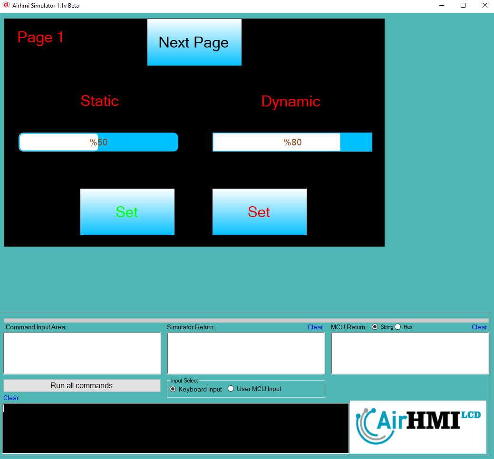
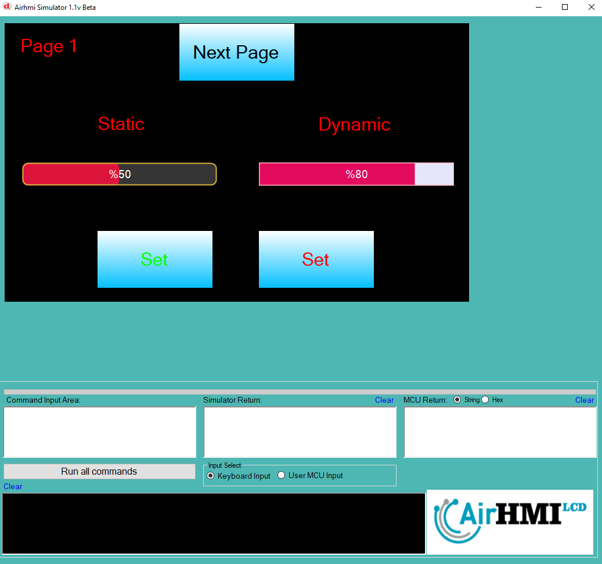
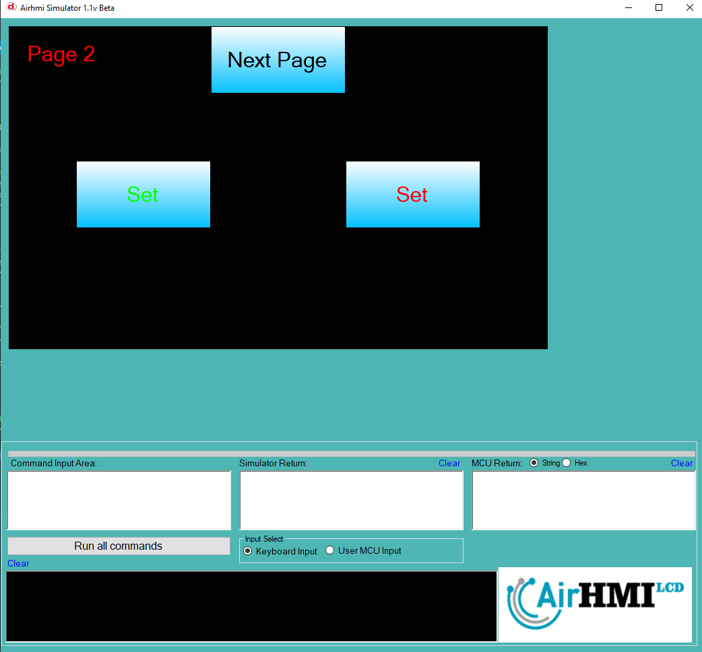
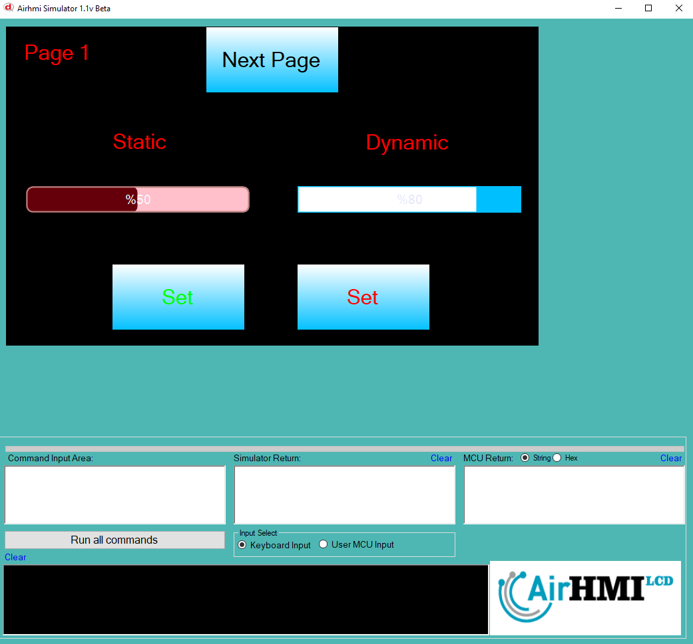

# ProgressBar Color Özelliği


```
ProgressBarSet("ProgressBar1" ,"COLOR" , "#DC143C"); 
// ProgressBar'ın dolum rengini (ön plan rengini) koyu kırmızı olarak ayarlar (#DC143C - Crimson).

ProgressBarSet("ProgressBar1" ,"BACKGROUND_COLOR" , "#353535"); 
// ProgressBar'ın arka plan rengini koyu gri olarak ayarlar (#353535).

ProgressBarSet("ProgressBar1" ,"BORDER_COLOR" , "#D4AF37"); 
// ProgressBar'ın çerçeve (kenarlık) rengini altın sarısı olarak ayarlar (#D4AF37 - Gold).

ProgressBarSet("ProgressBar1" ,"FONT_COLOR" , "#FFFFF0"); 
// ProgressBar üzerindeki yazının rengini açık beyaz (kırık beyaz) olarak ayarlar (#FFFFF0 - Ivory).


```

Bu dokümanda, statik ve dinamik olmak üzere iki farklı ProgressBarun rengi özelliği üzerinde etkili olan faktörler incelenmiştir.
Statik ProgressBarlar her sayfadan tüm özelliklerine ulaşılıp değiştirilebilen ProgressBarlardır. Static(false) yani dinamik ProgressBar'lar ise sayfaya özgüdür.
Sayfa değiştiği zaman hiçbir özelliği tutulmaz. Sayfa değişip tekrar aynı sayfaya gidildiği zaman ProgressBar ilk hali ile baştan meydana getirilir. 

## 📌 1. ProgressBar Tanımı
- **🟢 Statik ProgressBar**: Static özelliği true olan ProgressBar'dur. Color özelliği **hem aynı sayfadan hem de diğer sayfalardan** değiştirilebilir.
- **🔵 Dinamik ProgressBar**: Statik özelliği false olan ProgressBar'dur. Color  özelliği **yalnızca aynı sayfada** değiştirilebilir, diğer sayfalardan değiştirilemez.

## 🔍 2. ProgressBar NEEDLE_COLOR ve NEEDLE_CIRCLE_COLOR Değiştirme Durumları
### 🏠 Aynı Sayfada Olası Senaryolar
- Kullanıcı **statik ProgressBarun Color değerini** değiştirebilir.
- Kullanıcı **dinamik ProgressBarun Color değerini** değiştirebilir.


### 🔄 Farklı Sayfadan Olası Senaryolar
- Kullanıcı **statik ProgressBarun Color değerini** değiştirebilir.
- Kullanıcı **dinamik ProgressBarun Color değerini değiştiremez.**
- **Statik ProgressBar**, farklı sayfadan Color değerini değiştirirsek, aynı sayfaya dönüldüğünde **yeni değiştirilen Color değeri gelir.**
- **Dinamik ProgressBarun Color değerini değiştirsek bile etki etmez.**

## 🎯 4. Sonuç
✔️ Aynı sayfada **her iki ProgressBarun Color değerini değiştirilebilir**.  
✔️ **Statik ProgressBarun Color değerini** diğer sayfalardan değiştirilebilir.  
✔️ **Dinamik ProgressBarun Color değerini** yalnızca oluşturulduğu sayfada değiştirilebilir.  








