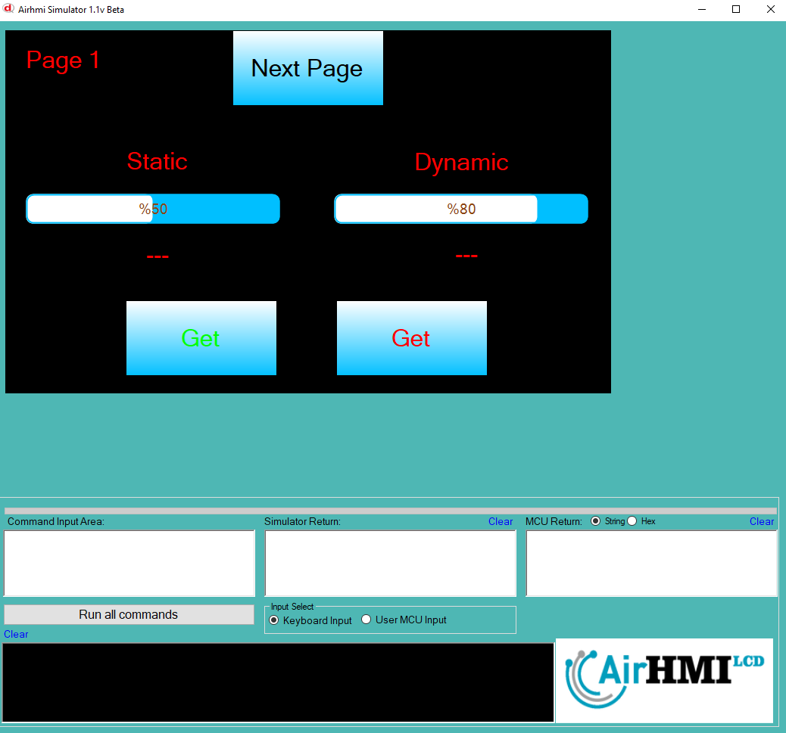

# ProgressBar Value Get Özelliği

Bu dokümanda, statik ve dinamik olmak üzere iki farklı ProgressBar Value Get durumları üzerinde etkili olan faktörler incelenmiştir.
Statik ProgressBar, her sayfadan tüm özelliklerine ulaşılıp değiştirilebilen ProgressBar'dır. **Static(false)** yani dinamik ProgressBar'lar ise sayfaya özgüdür.
Sayfa değiştiği zaman hiçbir özelliği tutulmaz. Sayfa değişip tekrar aynı sayfaya gidildiği zaman ProgressBar ilk hali ile baştan oluşturulur. 

```
ProgressBarSet("ProgressBar1" ,"Value" , "45");
```

## 📌 1. ProgressBar Tanımı
- **🟢 Statik ProgressBar**: Static özelliği **true** olan ProgressBar'dir. Value Get özelliği **hem aynı sayfadan hem de diğer sayfalardan** alınabilinir.
- **🔵 Dinamik ProgressBar**: Static özelliği **false** olan ProgressBar'dir. Value Get özelliği **yalnızca aynı sayfada** alınabilinir., diğer sayfalardan alınamaz.

## 🔍 2. ProgressBar Value Get Durumları
### 🏠 Aynı Sayfada Olası Senaryolar
- Kullanıcı **statik ProgressBar Value Get** değeri alır. .
- Kullanıcı **dinamik ProgressBar Value Get** değeri alır. .

### 🔄 Farklı Sayfadan Olası Senaryolar
- Kullanıcı **statik ProgressBar Value Get** değeri alır. .
- Kullanıcı **dinamik ProgressBar Value Get** değeri alamaz.

## 🎯 3. Sonuç
✔️ Aynı sayfada **her iki ProgressBar Value Get durumu alınabilinir.**.  
✔️ **Statik ProgressBar Value Get** diğer sayfalardan alınabilinir.  
✔️ **Dinamik ProgressBar Value Get** yalnızca oluşturulduğu sayfada alınabilinir.  

Bu bilgiler ışığında, **Value Get değişikliklerinin beklenen sonuçları doğru şekilde ele alınmalıdır.** 🚀

## Program İlk Açılış Görüntüsü


## Her iki ProgressBar'in de Value değeri alınıyor.


## Sonraki sayfaya geçiyoruz. ProgressBar Value değerini alıyoruz.
- **Statik olan ProgressBar'in değeri alınmıştır.**  
- **Dinamik olan ProgressBar ise değeri alınamamıştır.**


