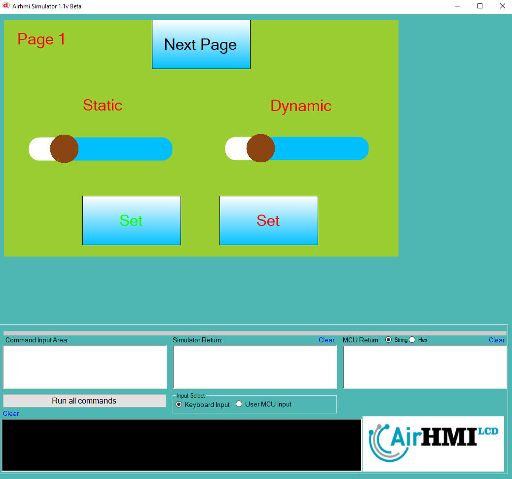
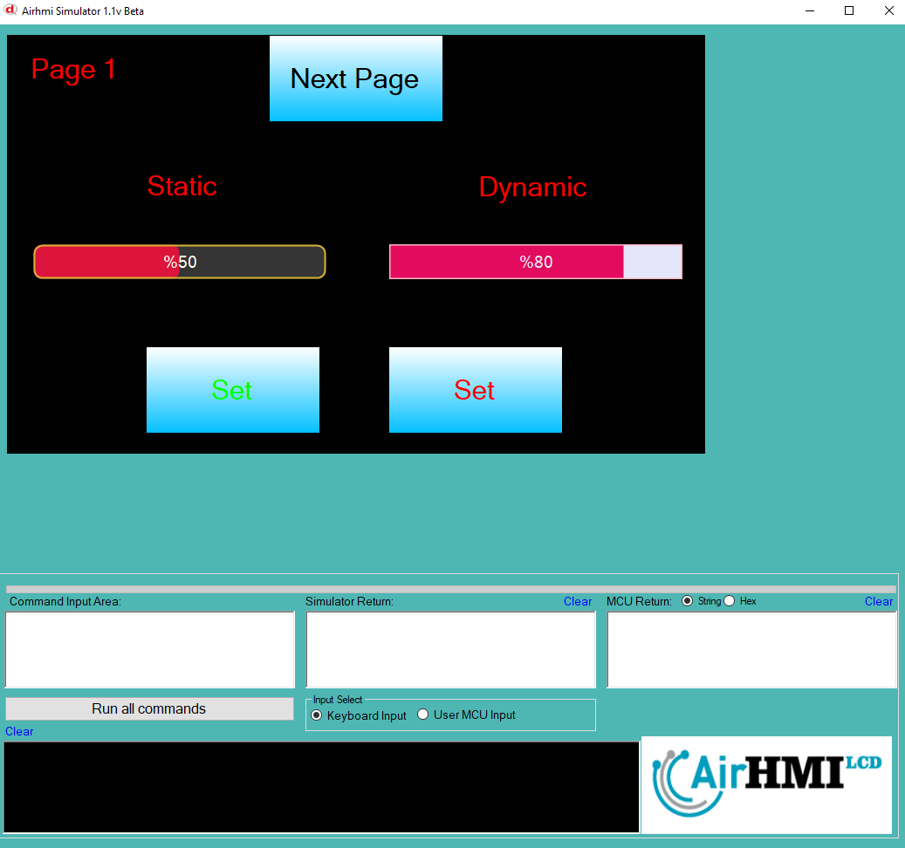
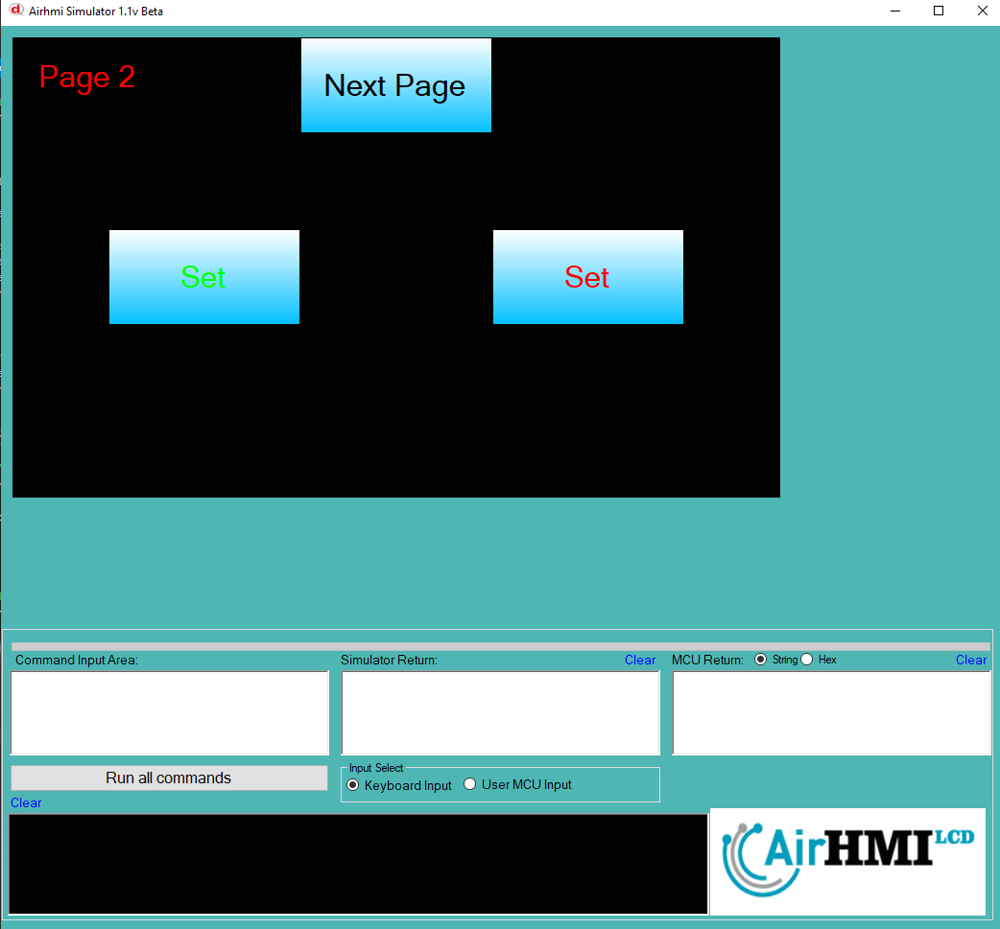
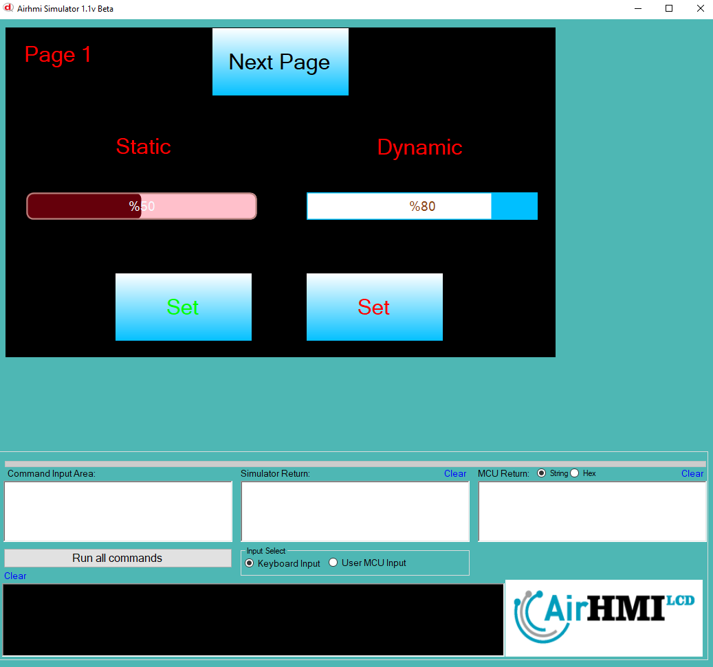

# Slider Color Özelliği


```
// Slider'ın ana rengini belirler. Bu renk, genellikle kaydırıcının aktif alanını temsil eder.  
// "#FF4500" kodu, "Orange Red" yani turuncu-kırmızı bir tonu ifade eder.  
SliderSet("Slider1" ,"COLOR" , "#FF4500"); // Orange Red  

// Kaydırıcının arka plan rengini belirler. Bu renk, genellikle kaydırıcının pasif alanını ve arka planını kapsar.  
// "#282828" kodu, "Charcoal Gray" yani kömür grisi tonunda koyu bir renktir.  
SliderSet("Slider1" ,"BACKGROUND_COLOR" , "#282828"); // Charcoal Gray  

// Kaydırıcının başlığının (thumb) rengini belirler. Bu renk, kaydırma düğmesi veya sürgü kısmı için kullanılır.  
// "#00CED1" kodu, "Dark Turquoise" yani koyu turkuaz rengidir, mavi-yeşil bir ton içerir.  
SliderSet("Slider1" ,"THUMB_COLOR" , "#00CED1"); // Dark Turquoise  

```

Bu dokümanda, statik ve dinamik olmak üzere iki farklı Sliderun rengi özelliği üzerinde etkili olan faktörler incelenmiştir.
Statik Sliderlar her sayfadan tüm özelliklerine ulaşılıp değiştirilebilen Sliderlardır. Static(false) yani dinamik Slider'lar ise sayfaya özgüdür.
Sayfa değiştiği zaman hiçbir özelliği tutulmaz. Sayfa değişip tekrar aynı sayfaya gidildiği zaman Slider ilk hali ile baştan meydana getirilir. 

## 📌 1. Slider Tanımı
- **🟢 Statik Slider**: Static özelliği true olan Slider'dur. Color özelliği **hem aynı sayfadan hem de diğer sayfalardan** değiştirilebilir.
- **🔵 Dinamik Slider**: Statik özelliği false olan Slider'dur. Color  özelliği **yalnızca aynı sayfada** değiştirilebilir, diğer sayfalardan değiştirilemez.

## 🔍 2. Slider NEEDLE_COLOR ve NEEDLE_CIRCLE_COLOR Değiştirme Durumları
### 🏠 Aynı Sayfada Olası Senaryolar
- Kullanıcı **statik Sliderun Color değerini** değiştirebilir.
- Kullanıcı **dinamik Sliderun Color değerini** değiştirebilir.


### 🔄 Farklı Sayfadan Olası Senaryolar
- Kullanıcı **statik Sliderun Color değerini** değiştirebilir.
- Kullanıcı **dinamik Sliderun Color değerini değiştiremez.**
- **Statik Slider**, farklı sayfadan Color değerini değiştirirsek, aynı sayfaya dönüldüğünde **yeni değiştirilen Color değeri gelir.**
- **Dinamik Sliderun Color değerini değiştirsek bile etki etmez.**

## 🎯 4. Sonuç
✔️ Aynı sayfada **her iki Sliderun Color değerini değiştirilebilir**.  
✔️ **Statik Sliderun Color değerini** diğer sayfalardan değiştirilebilir.  
✔️ **Dinamik Sliderun Color değerini** yalnızca oluşturulduğu sayfada değiştirilebilir.  








