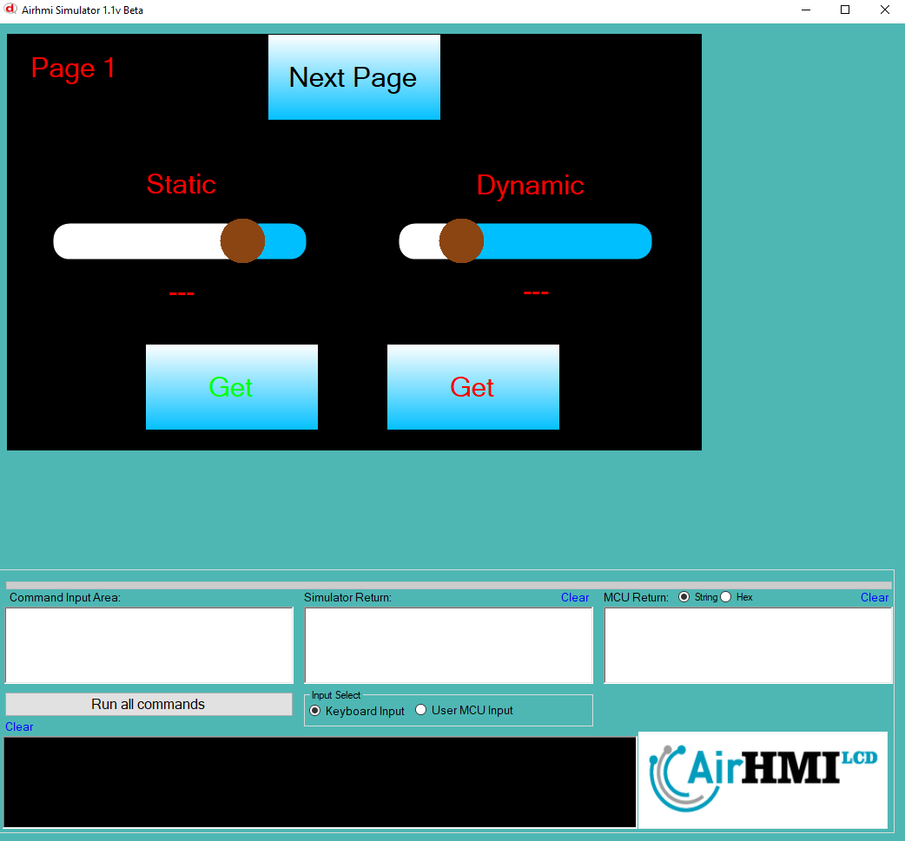
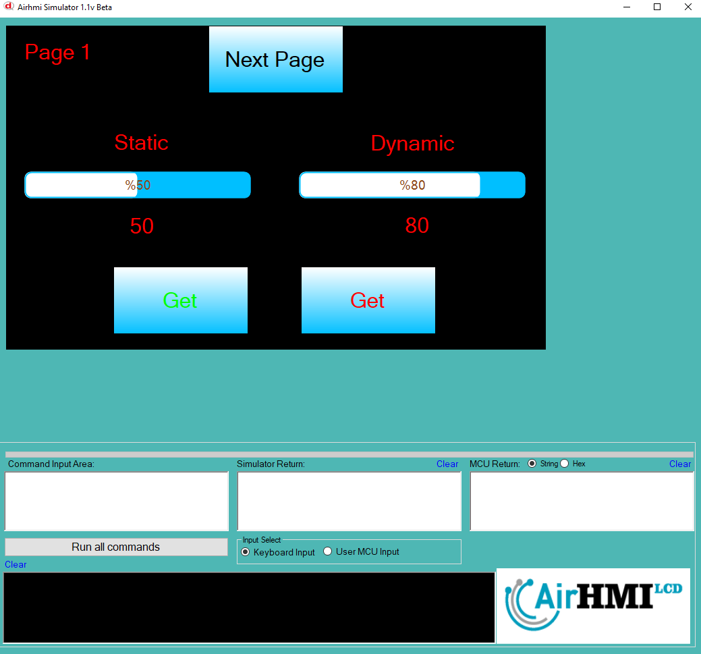
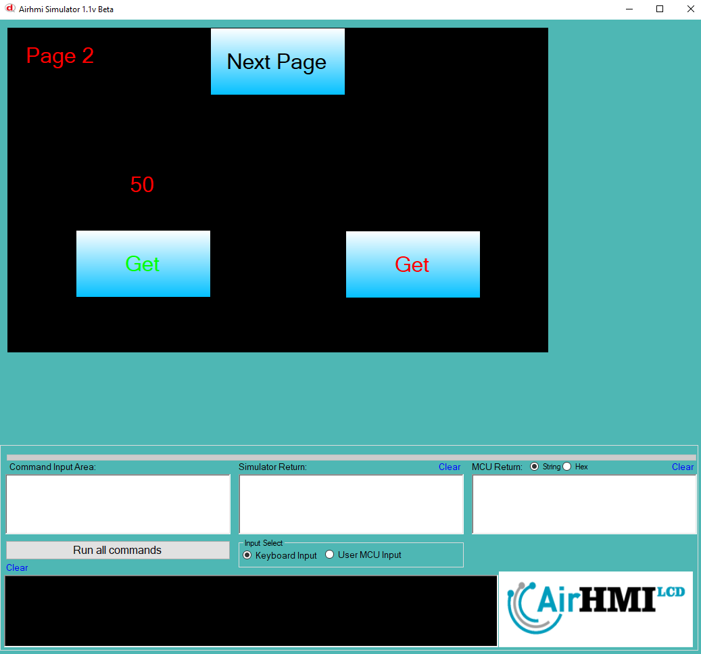

# Slider Value Get Özelliği

Bu dokümanda, statik ve dinamik olmak üzere iki farklı Slider Value Get durumları üzerinde etkili olan faktörler incelenmiştir.
Statik Slider, her sayfadan tüm özelliklerine ulaşılıp değiştirilebilen Slider'dır. **Static(false)** yani dinamik Slider'lar ise sayfaya özgüdür.
Sayfa değiştiği zaman hiçbir özelliği tutulmaz. Sayfa değişip tekrar aynı sayfaya gidildiği zaman Slider ilk hali ile baştan oluşturulur. 

```
SliderSet("Slider1" ,"Value" , "45");
```

## 📌 1. Slider Tanımı
- **🟢 Statik Slider**: Static özelliği **true** olan Slider'dir. Value Get özelliği **hem aynı sayfadan hem de diğer sayfalardan** alınabilinir.
- **🔵 Dinamik Slider**: Static özelliği **false** olan Slider'dir. Value Get özelliği **yalnızca aynı sayfada** alınabilinir., diğer sayfalardan alınamaz.

## 🔍 2. Slider Value Get Durumları
### 🏠 Aynı Sayfada Olası Senaryolar
- Kullanıcı **statik Slider Value Get** değeri alır. .
- Kullanıcı **dinamik Slider Value Get** değeri alır. .

### 🔄 Farklı Sayfadan Olası Senaryolar
- Kullanıcı **statik Slider Value Get** değeri alır. .
- Kullanıcı **dinamik Slider Value Get** değeri alamaz.

## 🎯 3. Sonuç
✔️ Aynı sayfada **her iki Slider Value Get durumu alınabilinir.**.  
✔️ **Statik Slider Value Get** diğer sayfalardan alınabilinir.  
✔️ **Dinamik Slider Value Get** yalnızca oluşturulduğu sayfada alınabilinir.  

Bu bilgiler ışığında, **Value Get değişikliklerinin beklenen sonuçları doğru şekilde ele alınmalıdır.** 🚀

## Program İlk Açılış Görüntüsü


## Her iki Slider'in de Value değeri alınıyor.


## Sonraki sayfaya geçiyoruz. Slider Value değerini alıyoruz.
- **Statik olan Slider'in değeri alınmıştır.**  
- **Dinamik olan Slider ise değeri alınamamıştır.**


