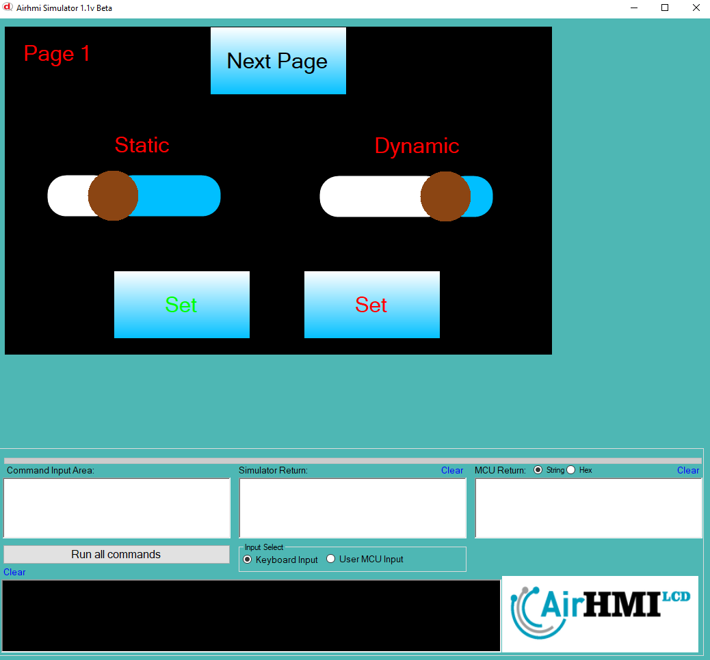
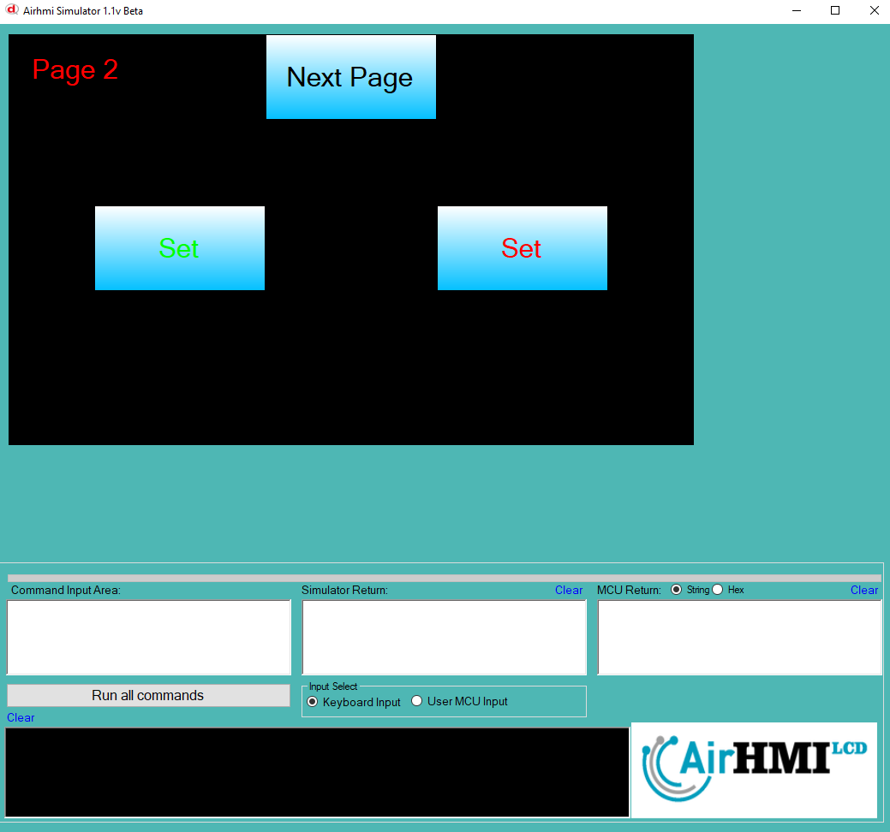
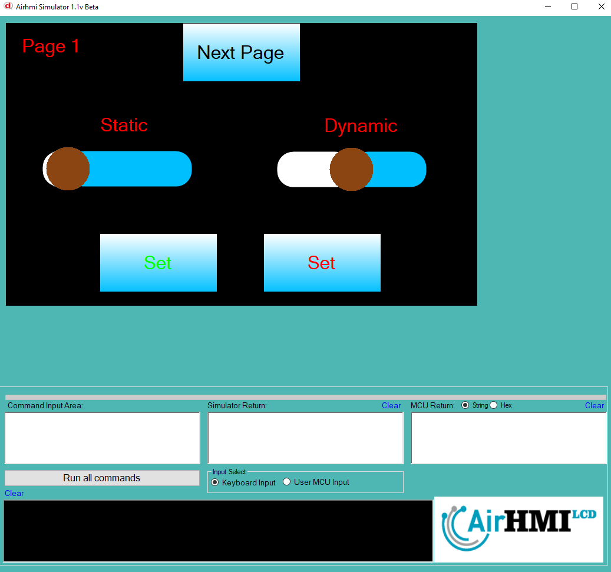

# ProgressBar Value Set Özelliği

Bu dokümanda, statik ve dinamik olmak üzere iki farklı ProgressBar Value Set durumları üzerinde etkili olan faktörler incelenmiştir.
Statik ProgressBar, her sayfadan tüm özelliklerine ulaşılıp değiştirilebilen ProgressBar'dır. **Static(false)** yani dinamik ProgressBar'lar ise sayfaya özgüdür.
Sayfa değiştiği zaman hiçbir özelliği tutulmaz. Sayfa değişip tekrar aynı sayfaya gidildiği zaman ProgressBar ilk hali ile baştan oluşturulur. 

```
ProgressBarSet("ProgressBar1" ,"Value" , "45");
```

## 📌 1. ProgressBar Tanımı
- **🟢 Statik ProgressBar**: Static özelliği **true** olan ProgressBar'dir. Value Set özelliği **hem aynı sayfadan hem de diğer sayfalardan** değiştirilebilir.
- **🔵 Dinamik ProgressBar**: Static özelliği **false** olan ProgressBar'dir. Value Set özelliği **yalnızca aynı sayfada** değiştirilebilir, diğer sayfalardan değiştirilemez.

## 🔍 2. ProgressBar Value Set Durumları
### 🏠 Aynı Sayfada Olası Senaryolar
- Kullanıcı **statik ProgressBar Value Set** yapabilir.
- Kullanıcı **dinamik ProgressBar Value Set** yapabilir.

### 🔄 Farklı Sayfadan Olası Senaryolar
- Kullanıcı **statik ProgressBar Value Set** yapabilir.
- Kullanıcı **dinamik ProgressBar Value Set** ile değiştiremez.

## 🎯 3. Sonuç
✔️ Aynı sayfada **her iki ProgressBar Value Set durumu değiştirilebilir**.  
✔️ **Statik ProgressBar Value Set** diğer sayfalardan değiştirilebilir.  
✔️ **Dinamik ProgressBar Value Set** yalnızca oluşturulduğu sayfada değiştirilebilir.  

Bu bilgiler ışığında, **Value Set değişikliklerinin beklenen sonuçları doğru şekilde ele alınmalıdır.** 🚀

## Program İlk Açılış Görüntüsü


## Her iki ProgressBar'in de Value değeri değiştiriliyor.


## Sonraki sayfaya geçiyoruz. ProgressBar Value değerini değiştiriyoruz.


## Birinci sayfaya tekrar dönüyoruz. 
- **Statik olan ProgressBar'in değeri değişmiştir.**  
- **Dinamik olan ProgressBar ise ilk değerini alır.**

