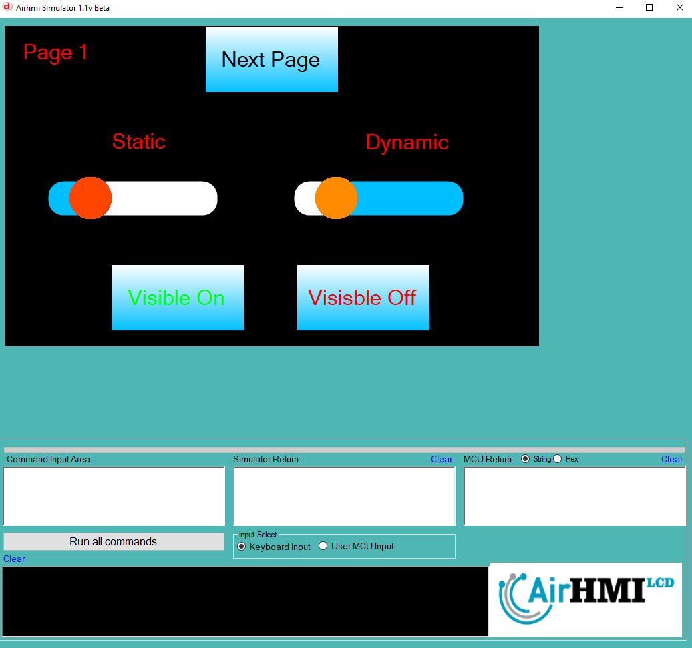
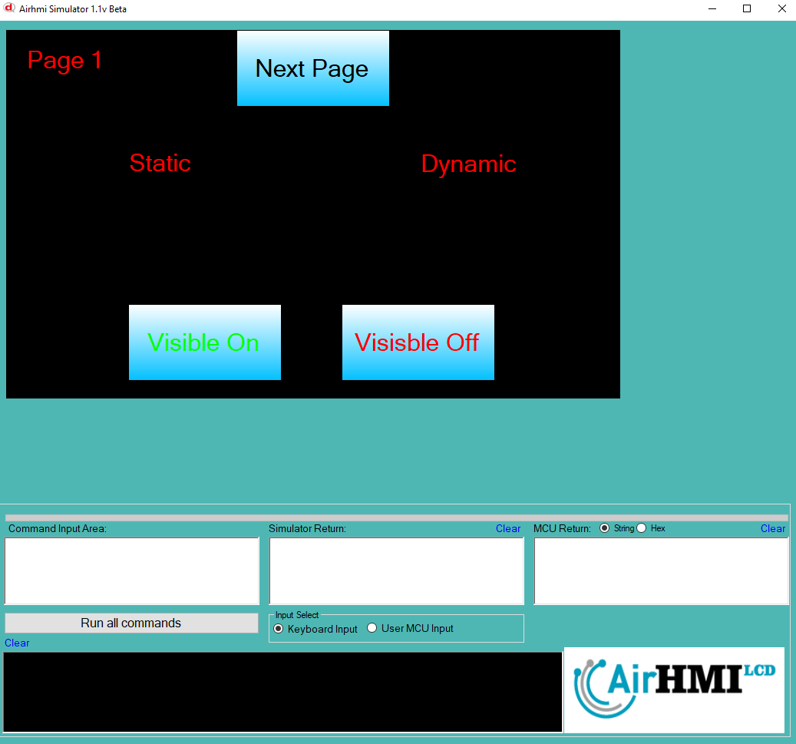
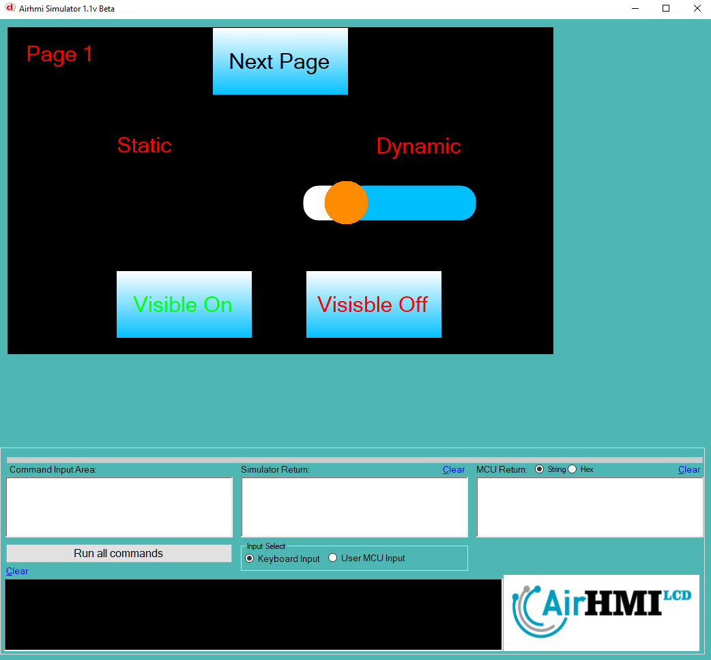

# Slider Görünürlük Özelliği

Bu dokümanda, statik ve dinamik olmak üzere iki farklı Slider'ın görünürlük durumları üzerinde etkili olan faktörler incelenmiştir.
Statik Sliderlar her sayfadan tüm özelliklerine ulaşılıp değiştirilebilen Sliderlardır. Static(false) yani dinamik Sliderlar ise sayfaya özgüdür.
Sayfa değiştiği zaman hiçbir özelliği tutulmaz. Sayfa değişip tekrar aynı sayfaya gidildiği zaman Slider ilk hali ile baştan meydana getirilir. 

## 📌 1. Sliderların Tanımı
- **🟢 Statik Slider**: Static özelliği true olan Slider'dır. Görünürlük (`Visible`) özelliği **hem aynı sayfadan hem de diğer sayfalardan** değiştirilebilir.
- **🔵 Dinamik Slider**: Statik özelliği false olan Slider'dır. Görünürlük (`Visible`) özelliği **yalnızca aynı sayfada** değiştirilebilir, diğer sayfalardan değiştirilemez.

## 🔍 2. Slider Görünürlük Durumları
### 🏠 Aynı Sayfada Olası Senaryolar
- Kullanıcı **statik Slider'ın görünürlüğünü** `true` veya `false` yapabilir.
- Kullanıcı **dinamik Slider'ın görünürlüğünü** `true` veya `false` yapabilir.
- **Her iki Slider da görünür olabilir.**
- **Her iki Slider da gizlenebilir.**

### 🔄 Farklı Sayfadan Olası Senaryolar
- Kullanıcı **statik Slider'ın görünürlüğünü** `true` veya `false` yapabilir.
- Kullanıcı **dinamik Slider'ın görünürlüğünü değiştiremez.**
- **Statik Slider**, farklı sayfadan gizlenirse, aynı sayfaya dönüldüğünde **görünmez** olur.
- **Dinamik Slider'ın görünürlük durumu korunur.**

## 📊 3. Olasılıklar Tablosu

| Senaryo | Statik Slider (Visible) | Dinamik Slider (Visible) | Açıklama |
|---------|------------------------|------------------------|-----------|
| ✅ 1 | `true`  | `true`  | Her iki Slider da görünür. |
| ✅ 2 | `true`  | `false` | Statik Slider görünür, dinamik Slider gizli. |
| ✅ 3 | `false` | `true`  | Statik Slider gizli, dinamik Slider görünür. |
| ✅ 4 | `false` | `false` | Her iki Slider da gizli. |
| ✅ 5 | `false` (Dışarıdan değiştirildi) | `true` | Farklı sayfada statik Slider kapatıldı, dinamik Slider etkilenmedi. |
| ✅ 6 | `true`  | `true` (Dışarıdan değiştirilemedi) | Statik Slider değiştirildi, dinamik Slider aynı kaldı. |

## 🎯 4. Sonuç
✔️ Aynı sayfada **her iki Slider'ın görünürlük durumu değiştirilebilir**.  
✔️ **Statik Slider'ın görünürlüğü** diğer sayfalardan değiştirilebilir.  
✔️ **Dinamik Slider'ın görünürlüğü** yalnızca oluşturulduğu sayfada değiştirilebilir.  

Bu bilgiler ışığında, **görünürlük değişikliklerinin beklenen sonuçları doğru şekilde ele alınmalıdır.** 🚀

