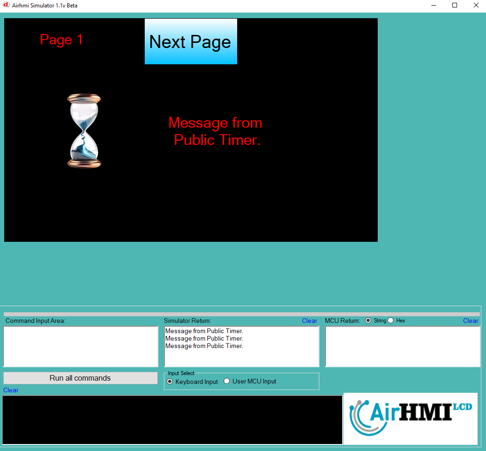
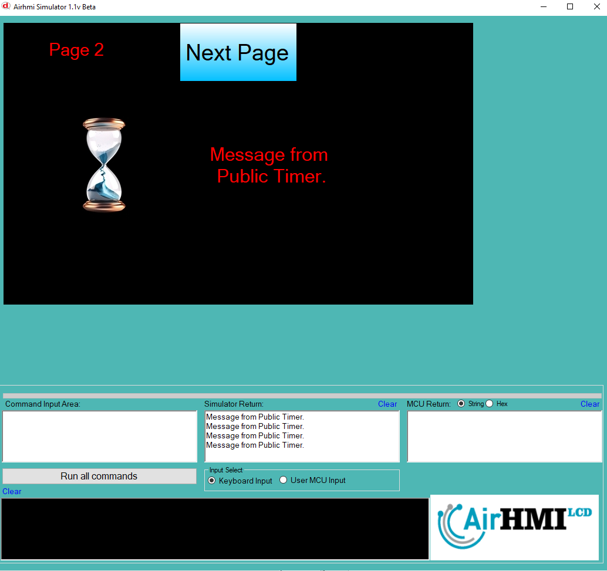

# Public Timer Özelliği

Public timer'lar, HMI ekranında tanımlandıktan sonra her sayfada aktif olarak çalışmaya devam eder ve sayfa geçişlerinden bağımsızdır. 
Kullanıcı farklı bir ekrana geçtiğinde veya uygulama içinde başka bir sayfayı açtığında bile public timer çalışmasını sürdürerek 
belirlenen görevleri yerine getirir. Bu sayede, sayfalar arasında geçiş yapılsa bile sürekli çalışması gereken işlemler,
 örneğin arka planda veri işleme, seri port haberleşmesi veya sistem durum takibi gibi görevler kesintiye uğramadan devam eder. 
 Public timer'lar, sistem genelinde ortak zamanlamaya ihtiyaç duyulan fonksiyonlar için kullanılır ve her sayfada aynı şekilde etkinliğini korur.

## Public Timer, bu sayfada aktif olarak çalışarak hem Label'i güncelliyor hem de seri porta veri gönderiyor.

## Public Timer bu sayfada da çalışmaya devam eder.

