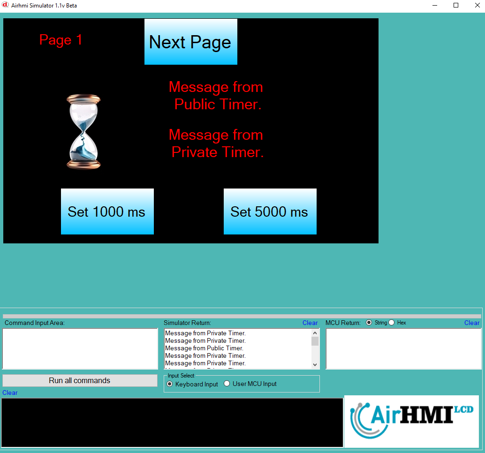

## Timer Interval Değiştirme

HMI sistemlerinde bir timer'ın çalışmasını özelleştirmenin bir diğer yolu da **interval süresini** değiştirmektir. Timer interval süresi, belirlenen zaman aralığında işlemin tekrar edilmesini sağlar. **TimerSet()** fonksiyonu ile timer'ın interval süresi değiştirilerek farklı periyotlarda çalıştırılması sağlanabilir.

Örnek kullanım:

```c
TimerSet("ETimer1", "Interval", "1000");
```

### Fonksiyon Parametreleri

1. **"ETimer1"**: Değiştirilecek timer'ın adı.
2. **"Interval"**: Timer'ın tekrar süresinin değiştirileceğini belirtir.
3. **"1000"**: Timer'ın yeni interval süresi (milisaniye cinsinden). Burada 1000 ms (1 saniye) olarak ayarlanmıştır.

Bu komut ile **ETimer1** her **1000 ms (1 saniye)** aralıklarla çalışacaktır. Eğer süre **500 ms** olarak ayarlanırsa, timer daha sık tetiklenir.

```c
TimerSet("ETimer1", "Interval", "500");
```

### Kullanım Senaryoları

- **Farklı zaman aralıklarında periyodik olarak veri göndermek**
- **Animasyon veya süreç kontrolü gibi zaman bazlı işlemlerin hızını değiştirmek**
- **Gecikme sürelerini dinamik olarak ayarlamak**
- **Kullanıcı etkileşimine bağlı olarak timer hızını değiştirmek**

Bu sayede **TimerSet()** fonksiyonu, sadece timer'ları başlatıp durdurmakla kalmaz, aynı zamanda **çalışma sürelerini esnek bir şekilde ayarlamaya olanak tanır**, böylece uygulamanın ihtiyaçlarına uygun olarak zamanlama yönetimi yapılabilir.

## Kullanım Senaryoları

- **Animasyon veya belirli bir işlemi periyodik olarak çalıştırmak için timer'ı başlatmak**
- **Kullanıcı belirli bir işlem gerçekleştirdiğinde (örneğin, butona bastığında) timer'ı devre dışı bırakmak**
- **Belirli bir süre boyunca sürekli veri gönderen bir işlemde, sürenin dolmasıyla timer'ı durdurmak**
- **Sayfa değişimlerine bağlı olarak timer'ı kontrol etmek**

Bu sayede **TimerSet() fonksiyonu**, HMI ekranında **zamanlama işlemlerinin yönetilmesini sağlayarak** kullanıcıya dinamik bir kontrol imkanı sunar.



