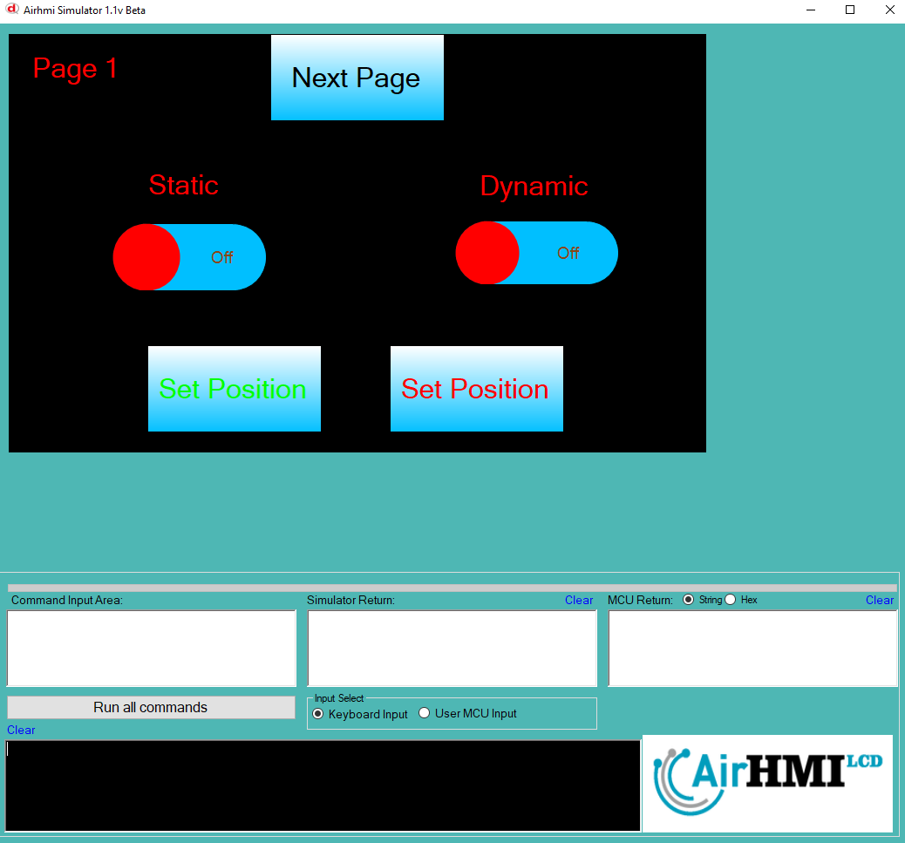
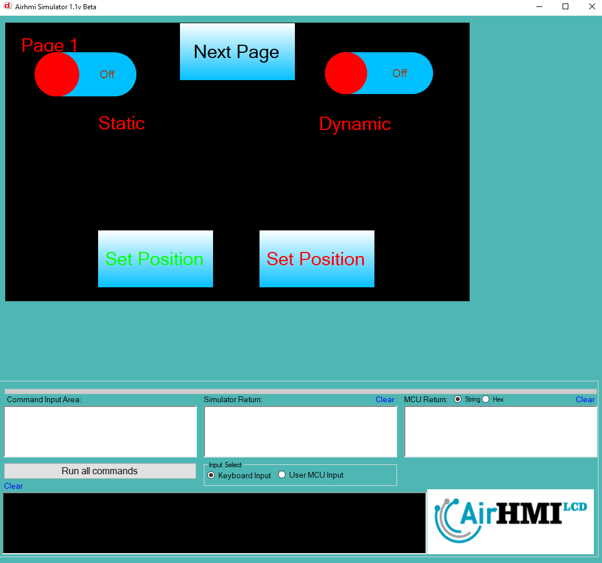
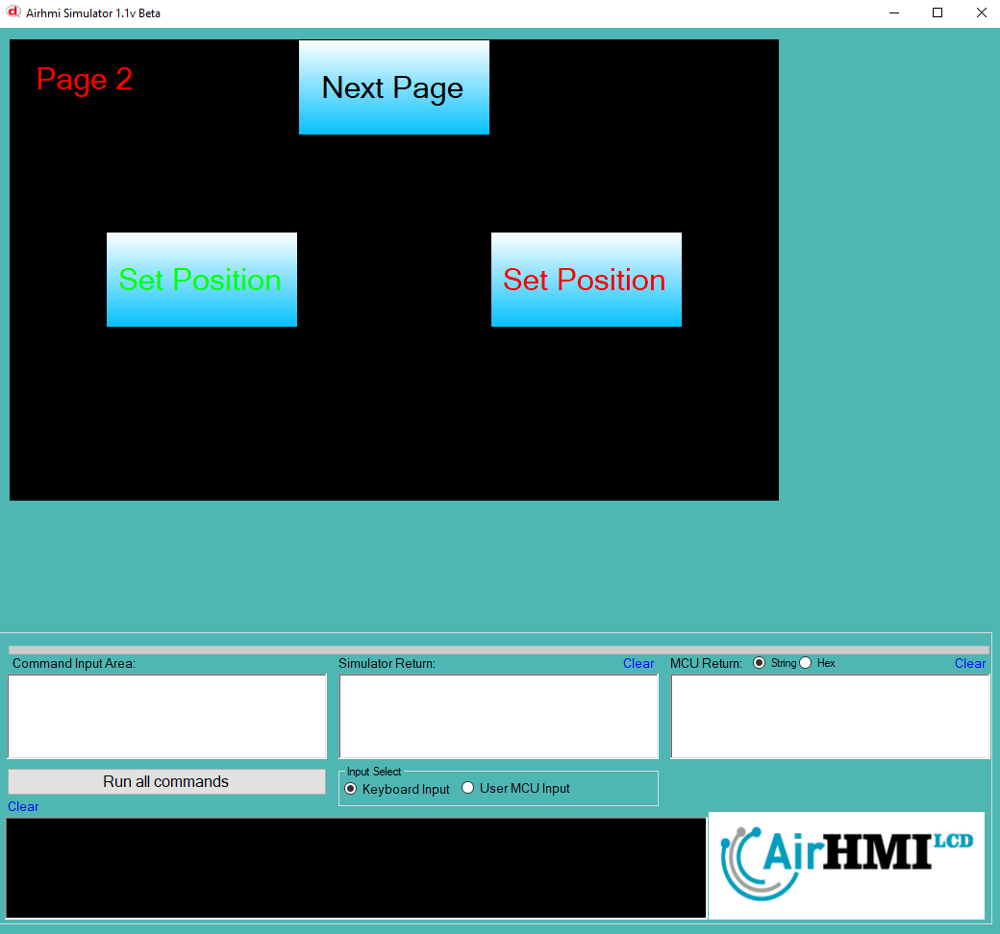
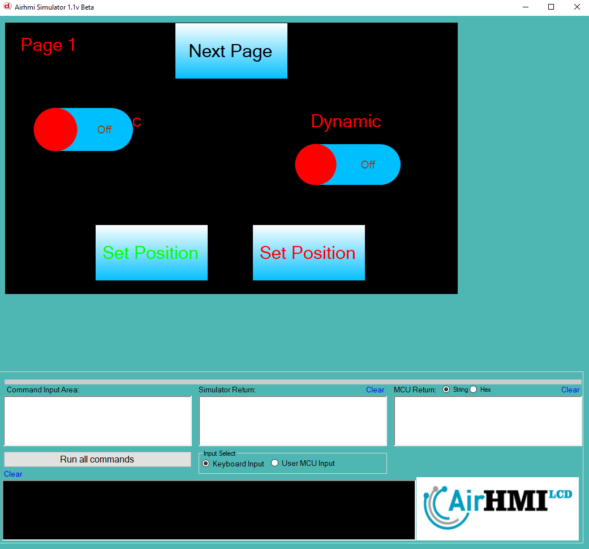

# Toggle Left Top Özelliği

Toggle ekran üzerindeki konumunu değiştirme işlemdir. 
Bu dokümanda, statik ve dinamik olmak üzere iki farklı Toggle Text özelliği üzerinde etkili olan faktörler incelenmiştir.
Statik Togglelar her sayfadan tüm özelliklerine ulaşılıp değiştirilebilen Togglelardır. Static(false) yani dinamik Togglelar ise sayfaya özgüdür.
Sayfa değiştiği zaman hiçbir özelliği tutulmaz. Sayfa değişip tekrar aynı sayfaya gidildiği zaman Toggle ilk hali ile baştan meydana getirilir. 

## 📌 1. Toggleların Tanımı
- **🟢 Statik Toggle**: Static özelliği true olan Toggledur. Left ve Top özelliği **hem aynı sayfadan hem de diğer sayfalardan** değiştirilebilir.
- **🔵 Dinamik Toggle**: Statik özelliği false olan Toggledur. Left ve Top özelliği **yalnızca aynı sayfada** değiştirilebilir, diğer sayfalardan değiştirilemez.

## 🔍 2. Toggle Left ve Top Değiştirme Durumları
### 🏠 Aynı Sayfada Olası Senaryolar
- Kullanıcı **statik Toggle Left ve Top değerini** değiştirebilir.
- Kullanıcı **dinamik Toggle Left ve Top değerini** değiştirebilir.

### 🔄 Farklı Sayfadan Olası Senaryolar
- Kullanıcı **statik Toggle Left ve Top değerini** değiştirebilir.
- Kullanıcı **dinamik Toggle Left ve Top değerini değiştiremez.**
- **Statik Toggle**, farklı sayfadan Left ve Top değerini değiştirirsek, aynı sayfaya dönüldüğünde **yeni değiştirilen text değeri gelir.**
- **Dinamik Toggle Left ve Top değerini değiştirsek bile etki etmez.**

## 🎯 4. Sonuç
✔️ Aynı sayfada **her iki Toggle Left ve Top değerini değiştirilebilir**.  
✔️ **Statik Toggle Left ve Top değerini** diğer sayfalardan değiştirilebilir.  
✔️ **Dinamik Toggle Left ve Top değerini** yalnızca oluşturulduğu sayfada değiştirilebilir.  

