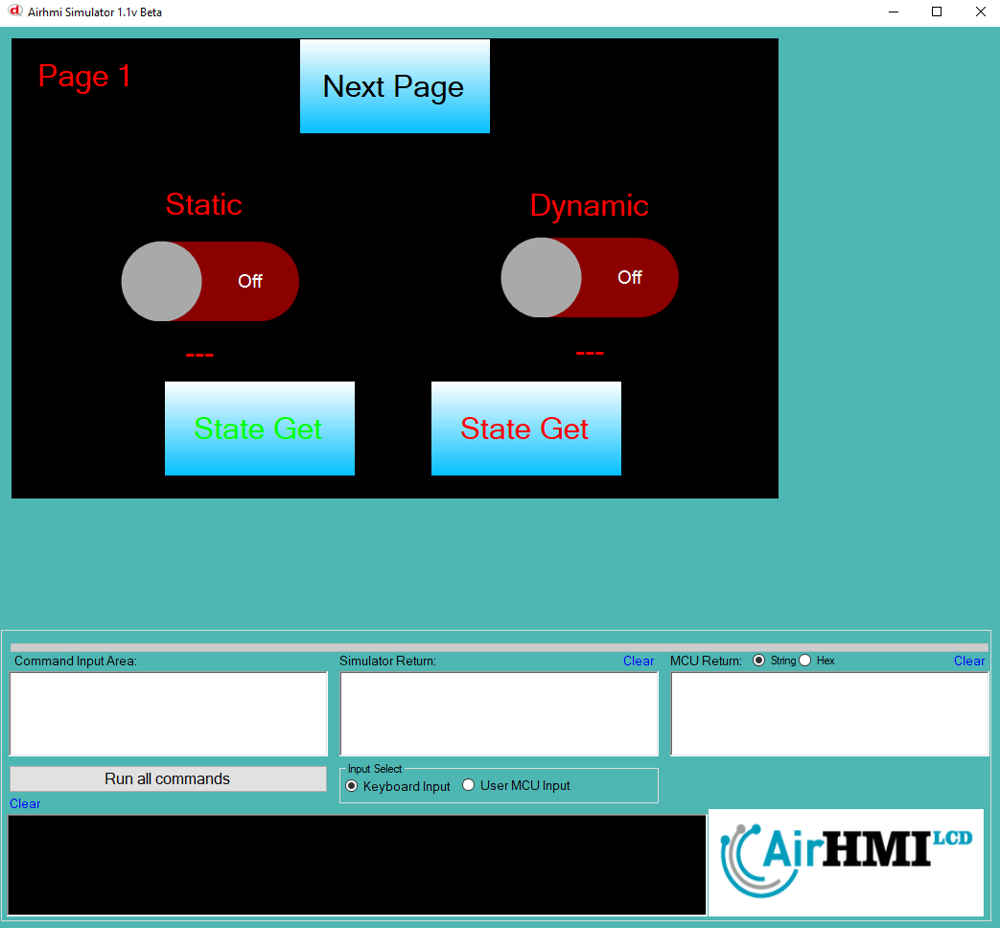
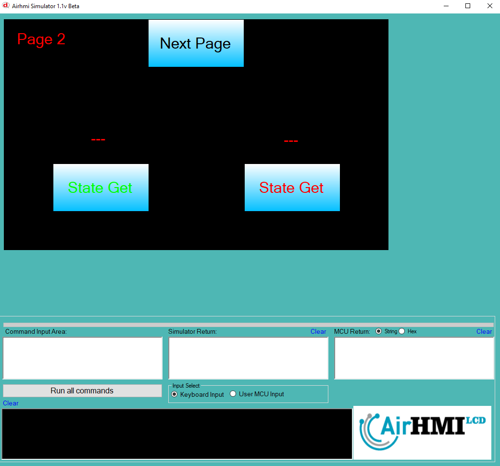

# Toggle State Get Özelliği

Toggle durumunu yazılım ile Get etmek için kullanılır.

char data[100];

ToggleGet("Toggle1" ,"State" , data);  // off durumu için 0 , on durumu için 1 gönderir.

Statik ve dinamik olmak üzere iki farklı Toggle State Get durumları üzerinde etkili olan faktörler incelenmiştir.
Statik Toggle lar her sayfadan tüm özelliklerine ulaşılıp değiştirilebilen nesnelerdir. Static(false) yani dinamik Toggle lar ise sayfaya özgüdür.
Sayfa değiştiği zaman hiçbir özelliği tutulmaz. Sayfa değişip tekrar aynı sayfaya gidildiği zaman Toggle ilk hali ile baştan meydana getirilir. 

## 📌 1. Toggle Tanımı
- **🟢 Statik Toggle**: Static özelliği true olan Toggle dır. State Get  özelliği **hem aynı sayfadan hem de diğer sayfalardan** değeri alınır..
- **🔵 Dinamik Toggle**: Statik özelliği false olan Toggle dır. State Get  özelliği **yalnızca aynı sayfada** değeri alınır., diğer sayfalardan değeri alınamaz.

## 🔍 2. Toggle State Get Durumları
### 🏠 Aynı Sayfada Olası Senaryolar
- Kullanıcı **statik Toggle Get** `1` veya `0` değeri alınır..
- Kullanıcı **dinamik Toggle Get** `1` veya `0` değeri alınır..

### 🔄 Farklı Sayfadan Olası Senaryolar
- Kullanıcı **statik Toggle Get** `1` veya `0` değeri alınır..
- Kullanıcı **dinamik Toggle Get alınamaz.**

## 🎯 3. Sonuç
✔️ Aynı sayfada **her iki Toggle State Get durumu değeri alınır.**.  
✔️ **Statik Toggle Get** diğer sayfalardan değeri alınır..  
✔️ **Dinamik Toggle Get** yalnızca oluşturulduğu sayfada değeri alınır..  

Bu bilgiler ışığında, **State Get değişikliklerinin beklenen sonuçları doğru şekilde ele alınmalıdır.** 🚀

## Sayfa 1 deki statik toggle in değerini alabildik fakat , dinamik olan toggle in değerini alamadık.

