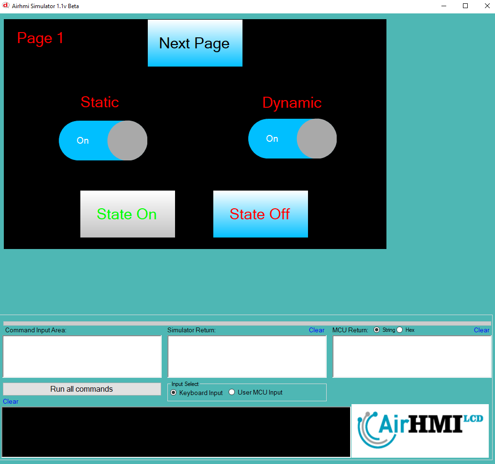
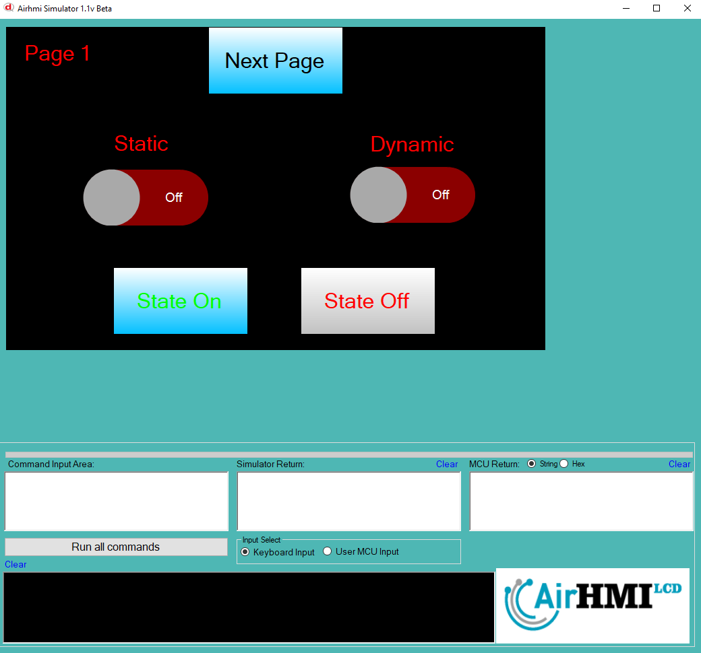
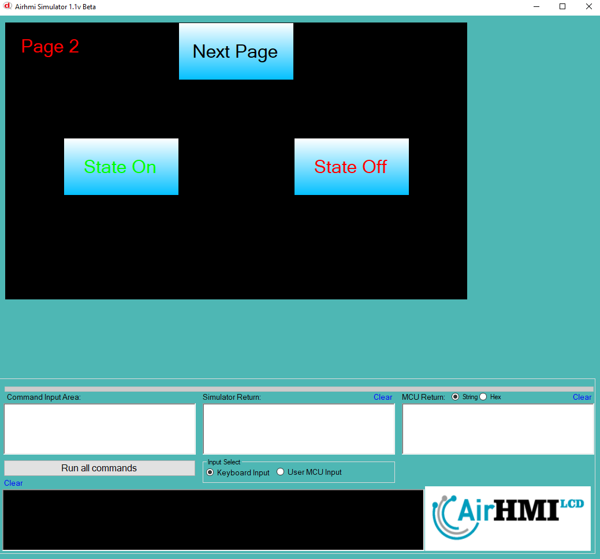
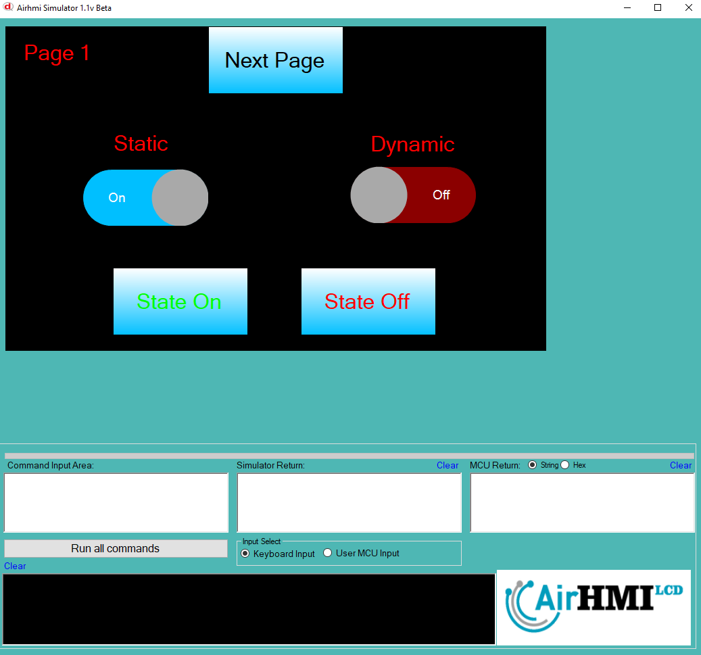

# Toggle State Set Özelliği

Toggle durumunu yazılım ile set etmek için kullanılır.

```
ToggleSet("Toggle1" ,"State" , "1"); // on durumuna geçirir.

ToggleSet("Toggle2" ,"State" , "0"); // off durumuna geçirir.
```
Statik ve dinamik olmak üzere iki farklı Toggle State Set durumları üzerinde etkili olan faktörler incelenmiştir.
Statik Toggle lar her sayfadan tüm özelliklerine ulaşılıp değiştirilebilen nesnelerdir. Static(false) yani dinamik Toggle lar ise sayfaya özgüdür.
Sayfa değiştiği zaman hiçbir özelliği tutulmaz. Sayfa değişip tekrar aynı sayfaya gidildiği zaman Toggle ilk hali ile baştan meydana getirilir. 

## 📌 1. Toggle Tanımı
- **🟢 Statik Toggle**: Static özelliği true olan Toggle dır. State Set  özelliği **hem aynı sayfadan hem de diğer sayfalardan** değiştirilebilir.
- **🔵 Dinamik Toggle**: Statik özelliği false olan Toggle dır. State Set  özelliği **yalnızca aynı sayfada** değiştirilebilir, diğer sayfalardan değiştirilemez.

## 🔍 2. Toggle State Set Durumları
### 🏠 Aynı Sayfada Olası Senaryolar
- Kullanıcı **statik Toggle Set** `1` veya `0` yapabilir.
- Kullanıcı **dinamik Toggle Set** `1` veya `0` yapabilir.
- **Her iki Toggle da görünür olabilir.**
- **Her iki Toggle da gizlenebilir.**

### 🔄 Farklı Sayfadan Olası Senaryolar
- Kullanıcı **statik Toggle Set** `1` veya `0` yapabilir.
- Kullanıcı **dinamik Toggle Set değiştiremez.**
- **Statik Toggle**, farklı sayfadan gizlenirse, aynı sayfaya dönüldüğünde **görünmez** olur.
- **Dinamik Toggle State Set durumu korunur.**

## 📊 3. Olasılıklar Tablosu


## 🎯 4. Sonuç
✔️ Aynı sayfada **her iki Toggle State Set durumu değiştirilebilir**.  
✔️ **Statik Toggle Set** diğer sayfalardan değiştirilebilir.  
✔️ **Dinamik Toggle Set** yalnızca oluşturulduğu sayfada değiştirilebilir.  

Bu bilgiler ışığında, **State Set değişikliklerinin beklenen sonuçları doğru şekilde ele alınmalıdır.** 🚀










