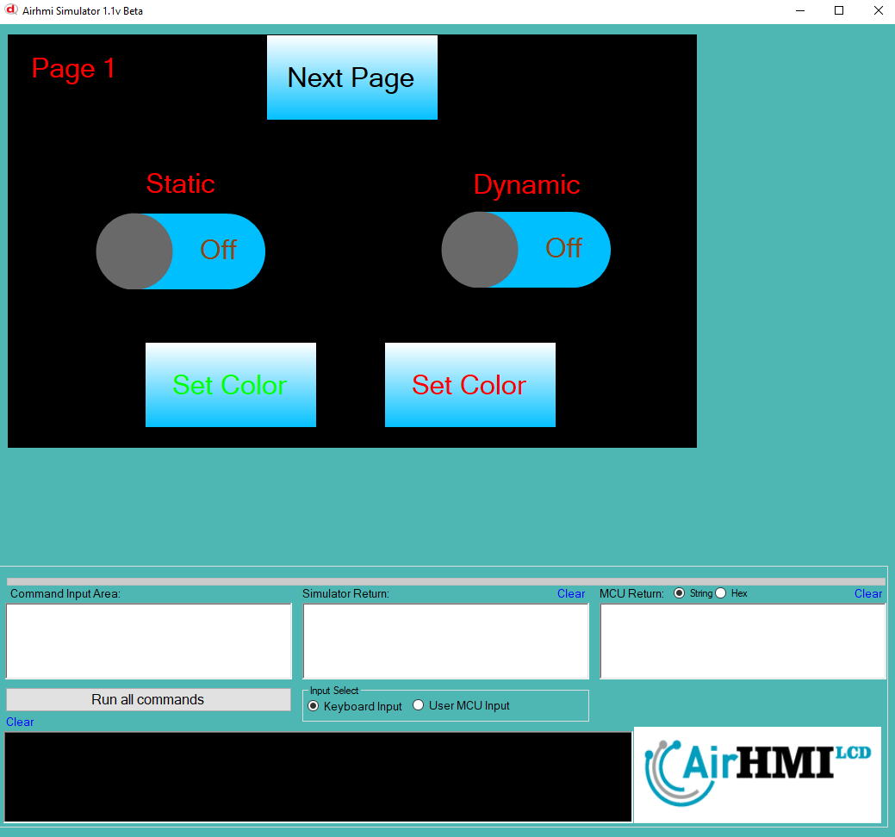
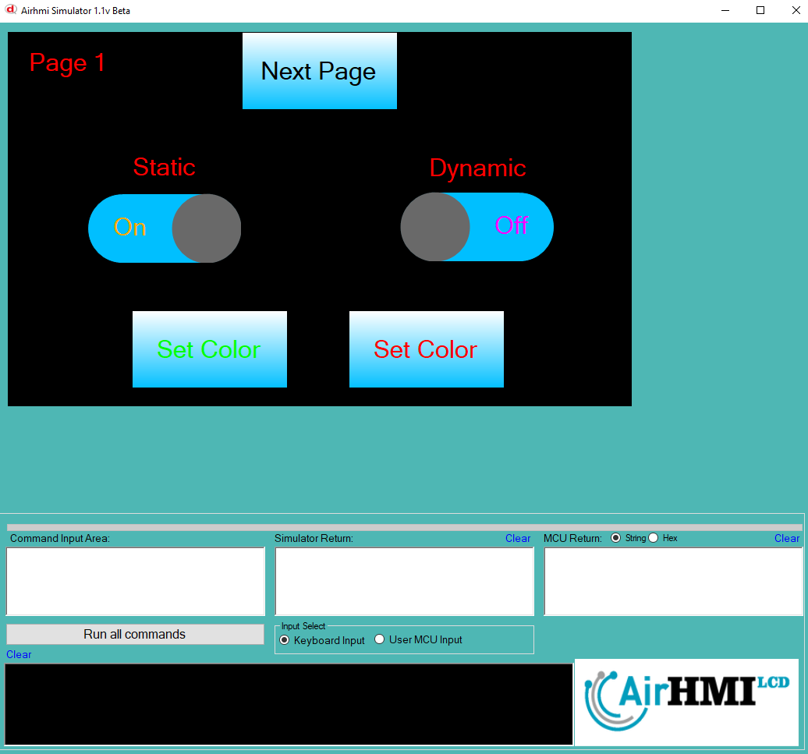
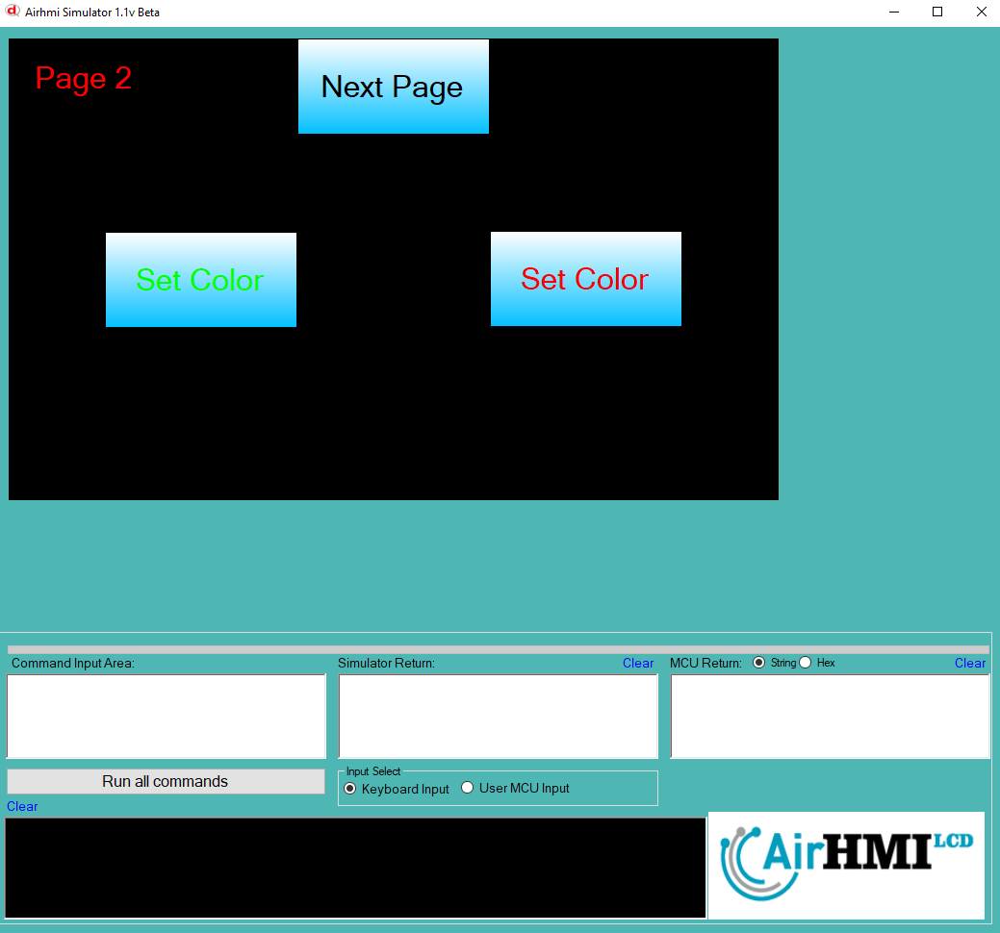

# Toggle Font Color Özelliği

Bu dokümanda, statik ve dinamik olmak üzere iki farklı Toggle Text rengi özelliği üzerinde etkili olan faktörler incelenmiştir.
Statik Togglelar her sayfadan tüm özelliklerine ulaşılıp değiştirilebilen Togglelardır. Static(false) yani dinamik Togglelar ise sayfaya özgüdür.
Sayfa değiştiği zaman hiçbir özelliği tutulmaz. Sayfa değişip tekrar aynı sayfaya gidildiği zaman Toggle ilk hali ile baştan meydana getirilir. 

## 📌 1. Toggleların Tanımı
- **🟢 Statik Toggle**: Static özelliği true olan Toggledur. Font_Color özelliği **hem aynı sayfadan hem de diğer sayfalardan** değiştirilebilir.
- **🔵 Dinamik Toggle**: Statik özelliği false olan Toggledur. Font_Color  özelliği **yalnızca aynı sayfada** değiştirilebilir, diğer sayfalardan değiştirilemez.

## 🔍 2. Toggle Font_Color Değiştirme Durumları
### 🏠 Aynı Sayfada Olası Senaryolar
- Kullanıcı **statik Toggle Text değerini** değiştirebilir.
- Kullanıcı **dinamik Toggle Text değerini** değiştirebilir.

### 🔄 Farklı Sayfadan Olası Senaryolar
- Kullanıcı **statik Toggle Font_Color değerini** değiştirebilir.
- Kullanıcı **dinamik Toggle Font_Color değerini değiştiremez.**
- **Statik Toggle**, farklı sayfadan Font_Color değerini değiştirirsek, aynı sayfaya dönüldüğünde **yeni değiştirilen Font_Color değeri gelir.**
- **Dinamik Toggle Font_Color değerini değiştirsek bile etki etmez.**

## 🎯 4. Sonuç
✔️ Aynı sayfada **her iki Toggle Font_Color değerini değiştirilebilir**.  
✔️ **Statik Toggle Font_Color değerini** diğer sayfalardan değiştirilebilir.  
✔️ **Dinamik Toggle Font_Color değerini** yalnızca oluşturulduğu sayfada değiştirilebilir.  

