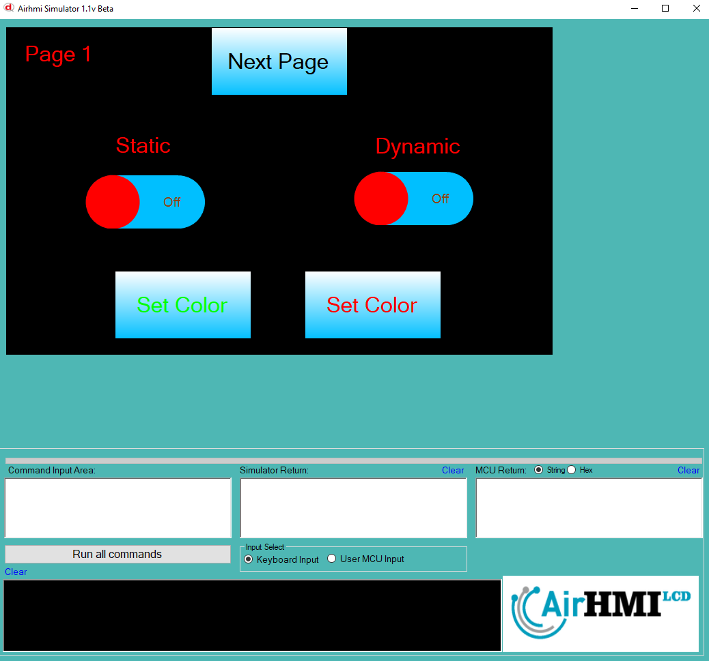
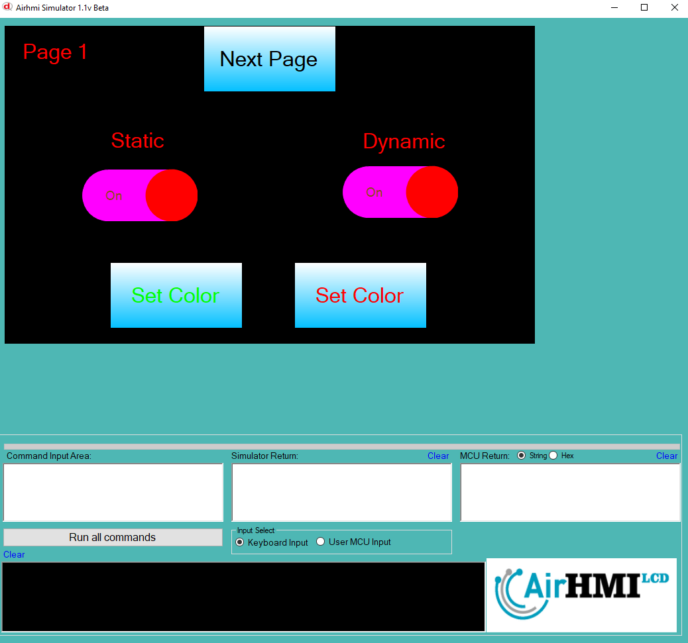
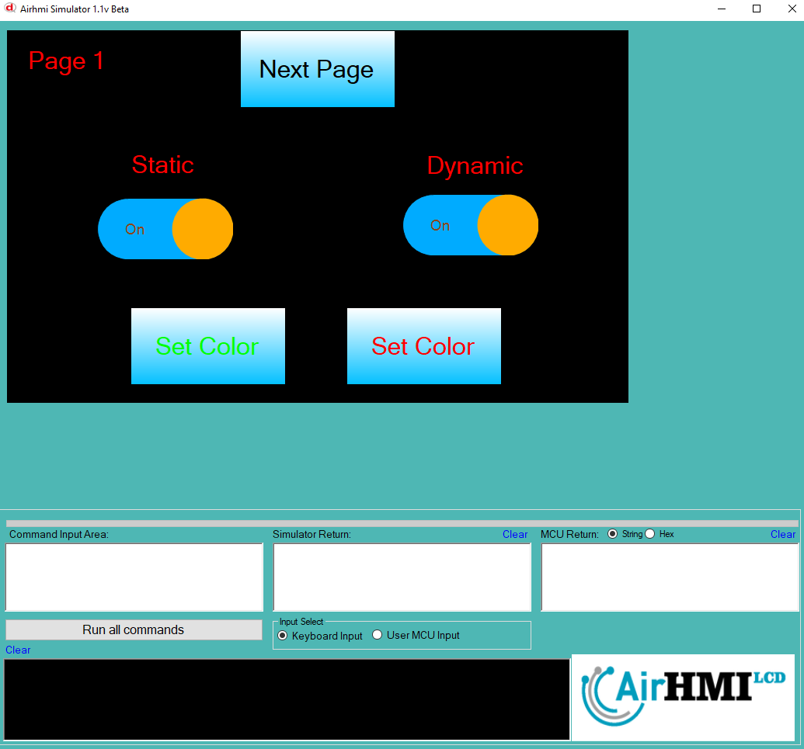

# Buton Color Özelliği

Bu dokümanda, statik ve dinamik olmak üzere iki farklı butonun rengi özelliği üzerinde etkili olan faktörler incelenmiştir.
Statik butonlar her sayfadan tüm özelliklerine ulaşılıp değiştirilebilen butonlardır. Static(false) yani dinamik butonlar ise sayfaya özgüdür.
Sayfa değiştiği zaman hiçbir özelliği tutulmaz. Sayfa değişip tekrar aynı sayfaya gidildiği zaman buton ilk hali ile baştan meydana getirilir. 

## 📌 1. Butonların Tanımı
- **🟢 Statik Buton**: Static özelliği true olan butondur. Color özelliği **hem aynı sayfadan hem de diğer sayfalardan** değiştirilebilir.
- **🔵 Dinamik Buton**: Statik özelliği false olan butondur. Color  özelliği **yalnızca aynı sayfada** değiştirilebilir, diğer sayfalardan değiştirilemez.

## 🔍 2. Buton Font_Color Değiştirme Durumları
### 🏠 Aynı Sayfada Olası Senaryolar
- Kullanıcı **statik butonun Color değerini** değiştirebilir.
- Kullanıcı **dinamik butonun Color değerini** değiştirebilir.

### 🔄 Farklı Sayfadan Olası Senaryolar
- Kullanıcı **statik butonun Color değerini** değiştirebilir.
- Kullanıcı **dinamik butonun Color değerini değiştiremez.**
- **Statik buton**, farklı sayfadan Color değerini değiştirirsek, aynı sayfaya dönüldüğünde **yeni değiştirilen Color değeri gelir.**
- **Dinamik butonun Color değerini değiştirsek bile etki etmez.**

## 🎯 4. Sonuç
✔️ Aynı sayfada **her iki butonun Color değerini değiştirilebilir**.  
✔️ **Statik butonun Color değerini** diğer sayfalardan değiştirilebilir.  
✔️ **Dinamik butonun Color değerini** yalnızca oluşturulduğu sayfada değiştirilebilir.  

