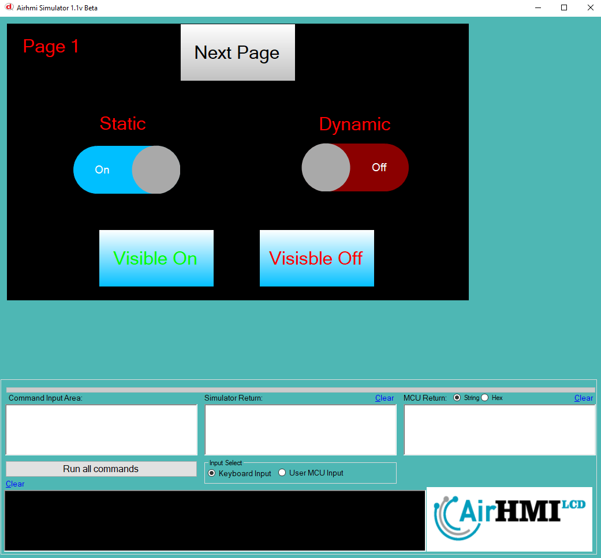
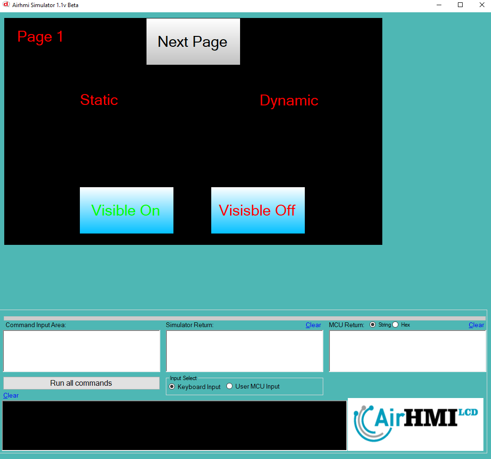
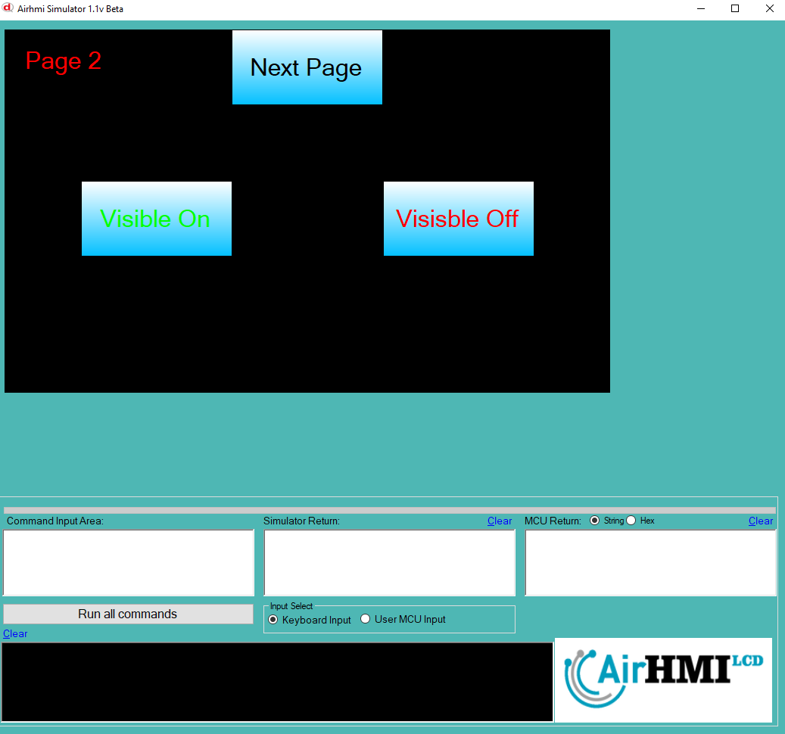
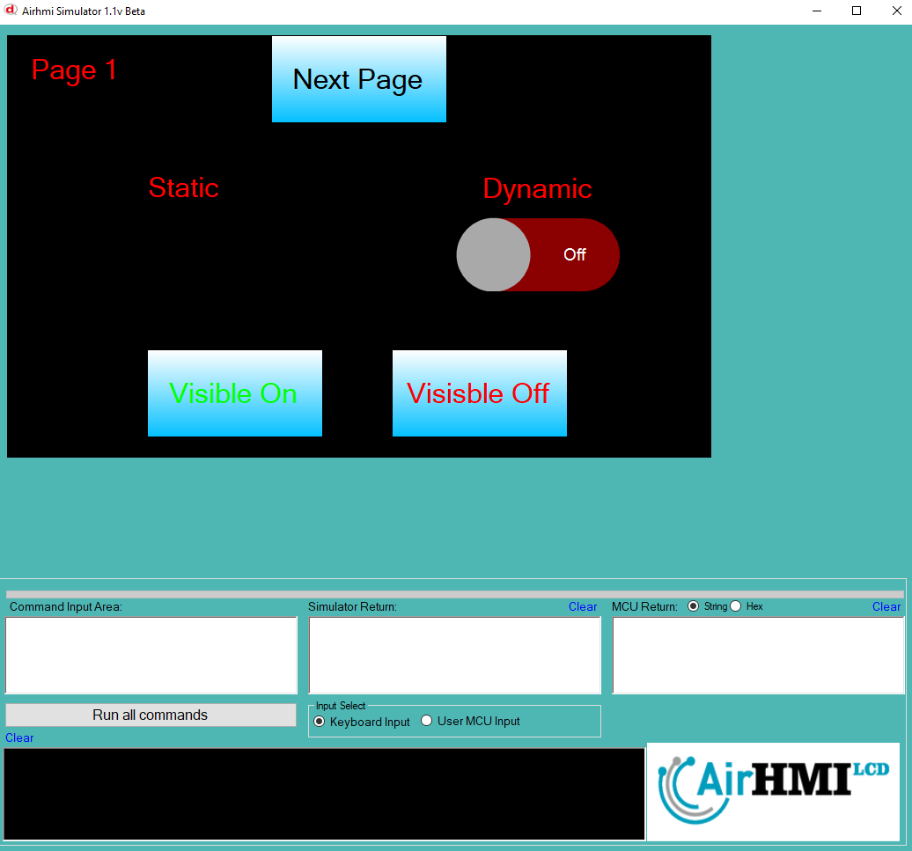

# Toggle Görünürlük Özelliği

Bu dokümanda, statik ve dinamik olmak üzere iki farklı Toggle görünürlük durumları üzerinde etkili olan faktörler incelenmiştir.
Statik Togglelar her sayfadan tüm özelliklerine ulaşılıp değiştirilebilen Togglelardır. Static(false) yani dinamik Togglelar ise sayfaya özgüdür.
Sayfa değiştiği zaman hiçbir özelliği tutulmaz. Sayfa değişip tekrar aynı sayfaya gidildiği zaman Toggle ilk hali ile baştan meydana getirilir. 

## 📌 1. Toggle Tanımı
- **🟢 Statik Toggle**: Static özelliği true olan Toggle dır. Görünürlük (`Visible`) özelliği **hem aynı sayfadan hem de diğer sayfalardan** değiştirilebilir.
- **🔵 Dinamik Toggle**: Statik özelliği false olan Toggle dır. Görünürlük (`Visible`) özelliği **yalnızca aynı sayfada** değiştirilebilir, diğer sayfalardan değiştirilemez.

## 🔍 2. Toggle Görünürlük Durumları
### 🏠 Aynı Sayfada Olası Senaryolar
- Kullanıcı **statik Toggle görünürlüğünü** `true` veya `false` yapabilir.
- Kullanıcı **dinamik Toggle görünürlüğünü** `true` veya `false` yapabilir.
- **Her iki Toggle da görünür olabilir.**
- **Her iki Toggle da gizlenebilir.**

### 🔄 Farklı Sayfadan Olası Senaryolar
- Kullanıcı **statik Toggle görünürlüğünü** `true` veya `false` yapabilir.
- Kullanıcı **dinamik Toggle görünürlüğünü değiştiremez.**
- **Statik Toggle**, farklı sayfadan gizlenirse, aynı sayfaya dönüldüğünde **görünmez** olur.
- **Dinamik Toggle görünürlük durumu korunur.**

## 📊 3. Olasılıklar Tablosu

| Senaryo | Statik Toggle (Visible) | Dinamik Toggle (Visible) | Açıklama |
|---------|------------------------|------------------------|-----------|
| ✅ 1 | `true`  | `true`  | Her iki Toggle da görünür. |
| ✅ 2 | `true`  | `false` | Statik Toggle görünür, dinamik Toggle gizli. |
| ✅ 3 | `false` | `true`  | Statik Toggle gizli, dinamik Toggle görünür. |
| ✅ 4 | `false` | `false` | Her iki Toggle da gizli. |
| ✅ 5 | `false` (Dışarıdan değiştirildi) | `true` | Farklı sayfada statik Toggle kapatıldı, dinamik Toggle etkilenmedi. |
| ✅ 6 | `true`  | `true` (Dışarıdan değiştirilemedi) | Statik Toggle değiştirildi, dinamik Toggle aynı kaldı. |

## 🎯 4. Sonuç
✔️ Aynı sayfada **her iki Toggle görünürlük durumu değiştirilebilir**.  
✔️ **Statik Toggle görünürlüğü** diğer sayfalardan değiştirilebilir.  
✔️ **Dinamik Toggle görünürlüğü** yalnızca oluşturulduğu sayfada değiştirilebilir.  

Bu bilgiler ışığında, **görünürlük değişikliklerinin beklenen sonuçları doğru şekilde ele alınmalıdır.** 🚀

