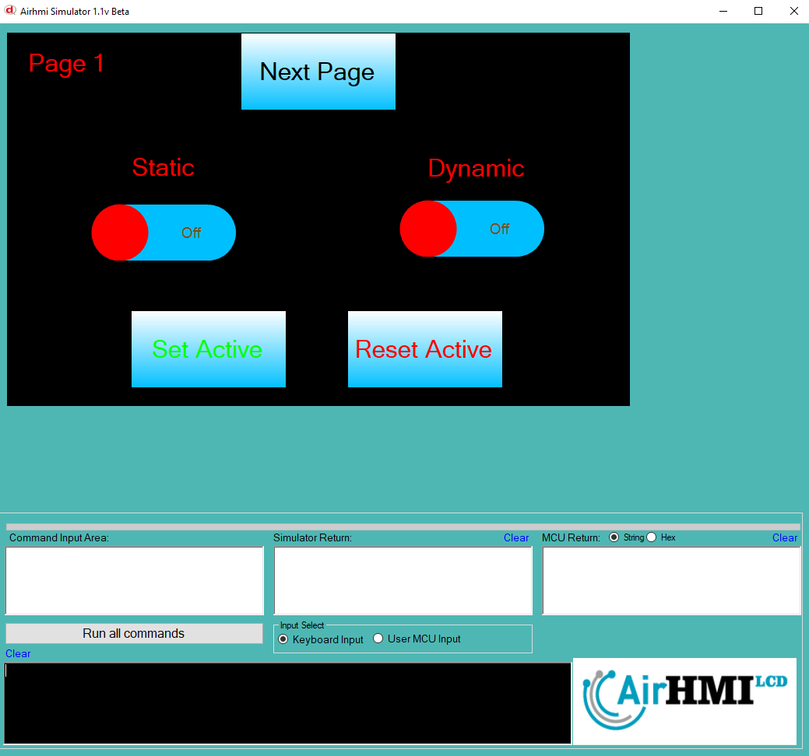
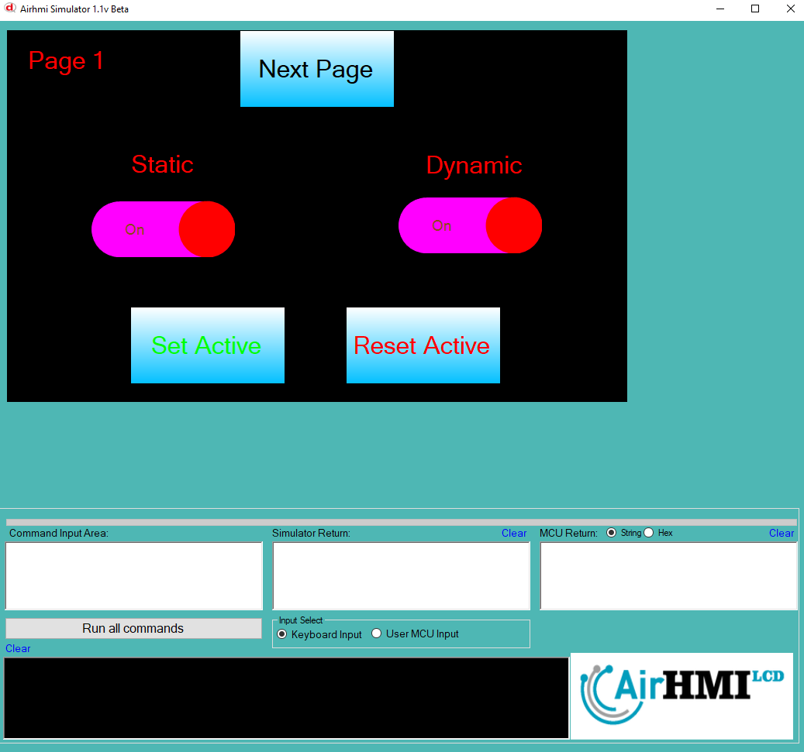
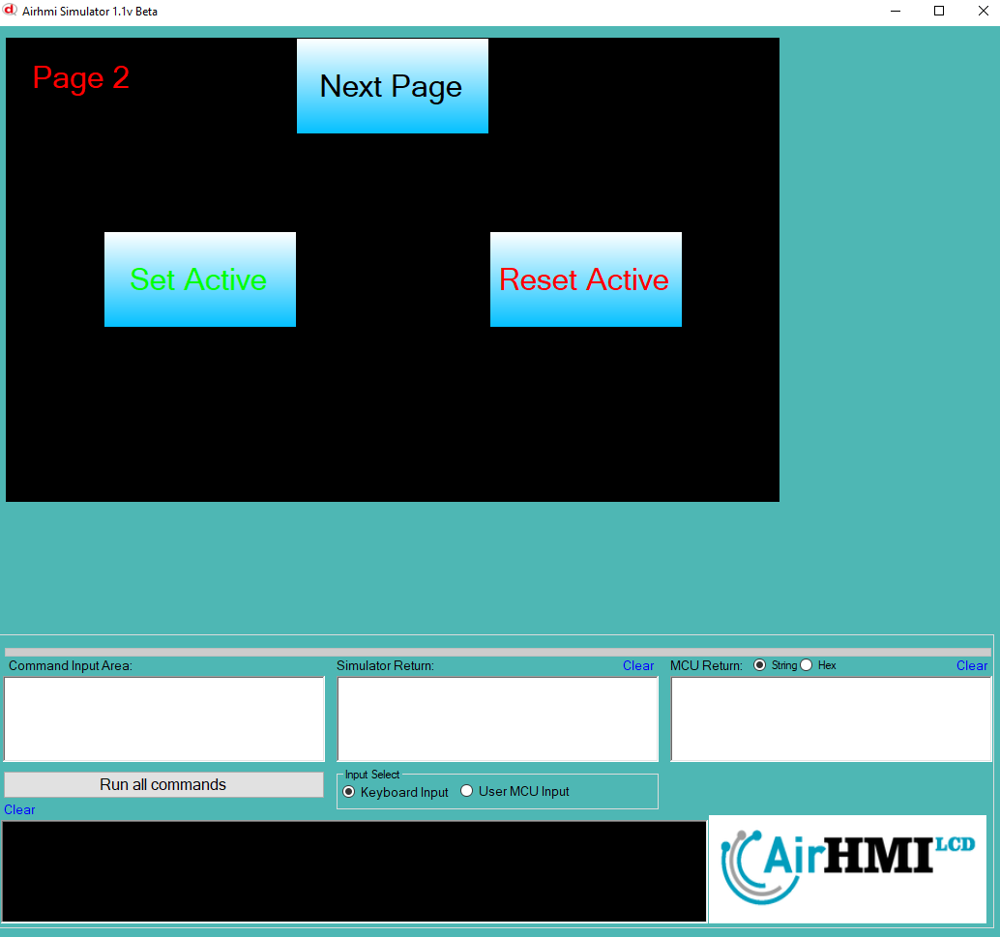
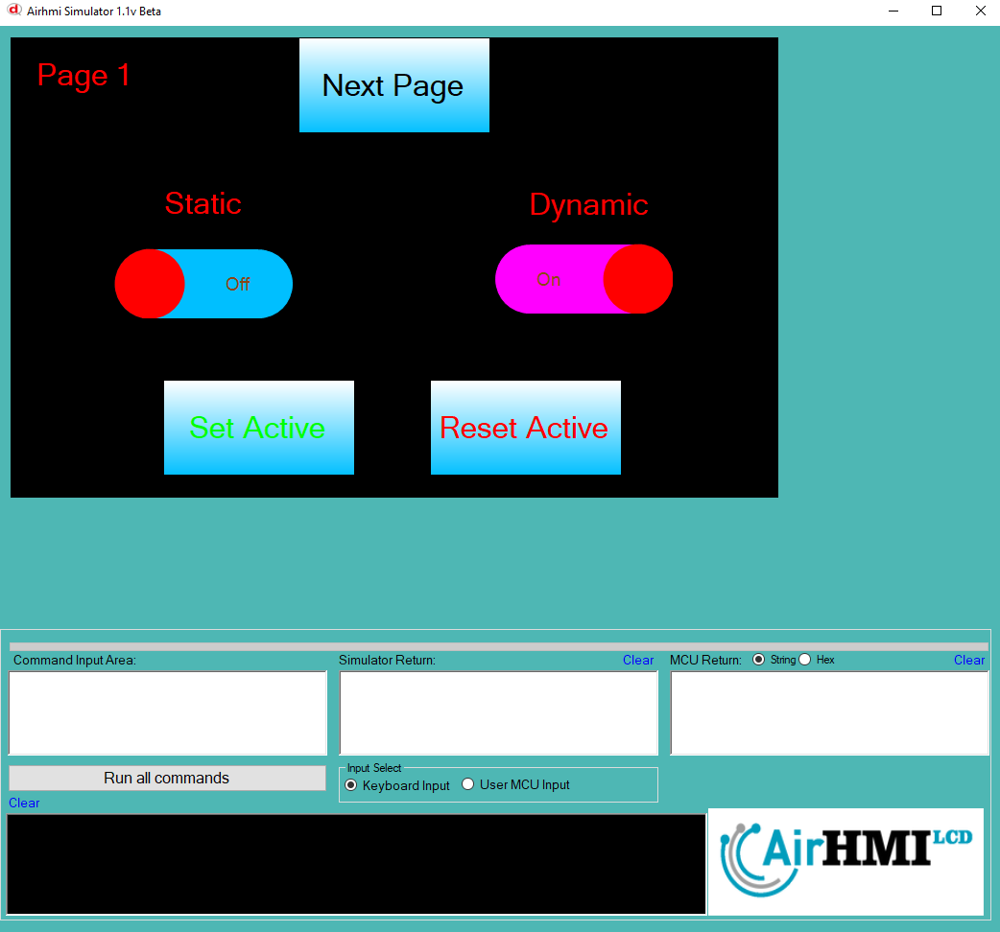

# Toggle Active Özelliği

Active özelliği Toggle basma işlemi için açma ve kapatma özelliğine sahip olması anlamına gelir.
Bu dokümanda, statik ve dinamik olmak üzere iki farklı Toggle Active özelliği üzerinde etkili olan faktörler incelenmiştir.
Statik Togglelar her sayfadan tüm özelliklerine ulaşılıp değiştirilebilen Togglelardır. Static(false) yani dinamik Togglelar ise sayfaya özgüdür.
Sayfa değiştiği zaman hiçbir özelliği tutulmaz. Sayfa değişip tekrar aynı sayfaya gidildiği zaman Toggle ilk hali ile baştan meydana getirilir. 

## 📌 1. Toggleların Tanımı
- **🟢 Statik Toggle**: Static özelliği true olan Toggledur. Active özelliği **hem aynı sayfadan hem de diğer sayfalardan** değiştirilebilir.
- **🔵 Dinamik Toggle**: Statik özelliği false olan Toggledur. Active  özelliği **yalnızca aynı sayfada** değiştirilebilir, diğer sayfalardan değiştirilemez.

## 🔍 2. Toggle Active Değiştirme Durumları
### 🏠 Aynı Sayfada Olası Senaryolar
- Kullanıcı **statik Toggle Active değerini** değiştirebilir.
- Kullanıcı **dinamik Toggle Active değerini** değiştirebilir.

### 🔄 Farklı Sayfadan Olası Senaryolar
- Kullanıcı **statik Toggle Active değerini** değiştirebilir.
- Kullanıcı **dinamik Toggle Active değerini değiştiremez.**
- **Statik Toggle**, farklı sayfadan Active değerini değiştirirsek, aynı sayfaya dönüldüğünde **yeni değiştirilen Active değeri gelir.**
- **Dinamik Toggle Active değerini değiştirsek bile etki etmez.**

## 🎯 4. Sonuç
✔️ Aynı sayfada **her iki Toggle Active değerini değiştirilebilir**.  
✔️ **Statik Toggle Active değerini** diğer sayfalardan değiştirilebilir.  
✔️ **Dinamik Toggle Active değerini** yalnızca oluşturulduğu sayfada değiştirilebilir.  

