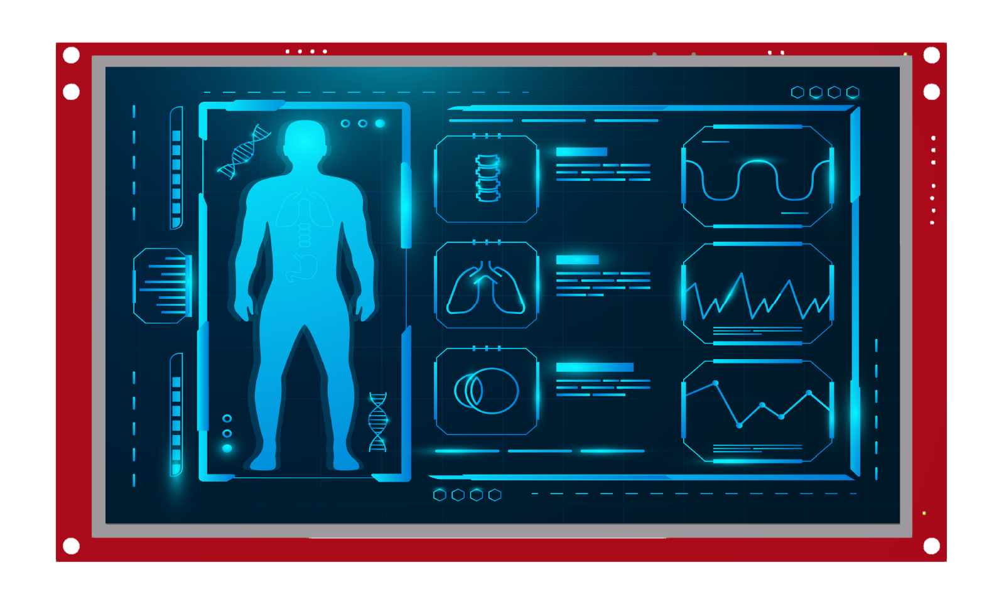
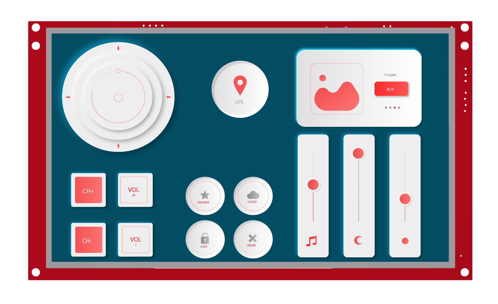

AirHMI Visual Screen Creator, AirHMI LCD ekranları için İnsan Makine Arayüzü GUI’lerini tasarım açışından en üst seviyede memnuniyet ve en verimli sürede oluşturabilmek amacıyla tasarlanmıştır. Editör kullanımında Tasarım ve Programlama dünyasına ait işlevselliklerimiz bulunmaktadır: Görsellik açısından zengin nesne hazinesinden özgün olabileceğiniz ve istekleriniz doğrultusunda rahatlıkla oluşturabileceğiniz ekran tasarımı desteğinin yanı sıra programlama kısmında da kullanıcıya birçok kolaylık sağlamaktadır.

# Yapay Zeka Desteği

