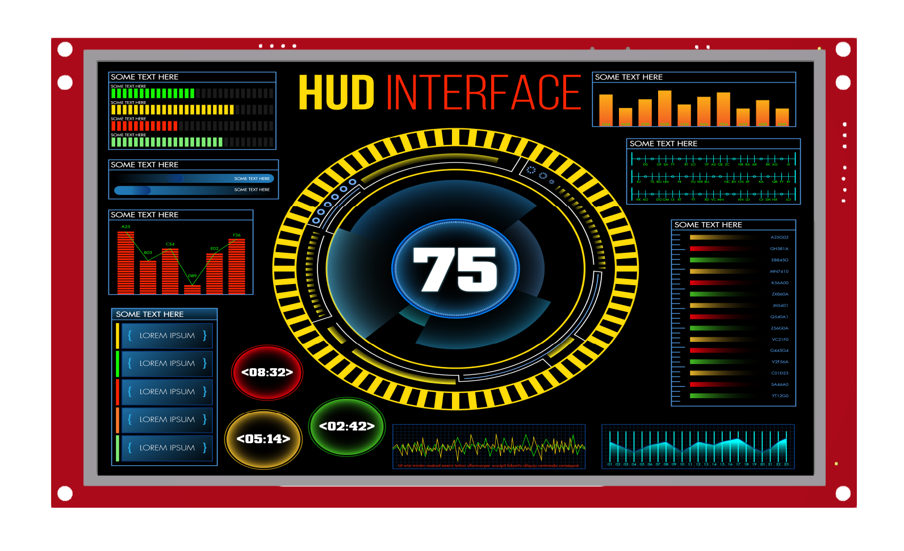

AirHMI Visual Screen Creator, AirHMI LCD ekranları için İnsan Makine Arayüzü GUI’lerini tasarım açışından en üst seviyede memnuniyet ve en verimli sürede oluşturabilmek amacıyla tasarlanmıştır. Editör kullanımında Tasarım ve Programlama dünyasına ait işlevselliklerimiz bulunmaktadır: Görsellik açısından zengin nesne hazinesinden özgün olabileceğiniz ve istekleriniz doğrultusunda rahatlıkla oluşturabileceğiniz ekran tasarımı desteğinin yanı sıra programlama kısmında da kullanıcıya birçok kolaylık sağlamaktadır.

# Airhmi GitHub İçeriği

GitHub sayfamız, Airhmi ekranları ile ilgili tüm kaynakları bir araya getiren kapsamlı bir platformdur. Burada, Airhmi ekranlarının tüm modellerine ve teknik detaylarına ulaşabilirsiniz. Ayrıca, cihazların nasıl kullanılacağına dair kapsamlı kılavuzlar ve belgeler de yer almaktadır.

Platformumuzda detaylı datasheet'ler, yani teknik özellikler ve donanım bilgileri de mevcuttur. Bu belgeler sayesinde, cihazların donanımsal yapısını, giriş-çıkış pinlerini ve çalışma prensiplerini detaylı bir şekilde öğrenebilirsiniz.

Ayrıca, docs (dokümantasyon) bölümünde, kullanım kılavuzları ile birlikte, cihazların nasıl kurulacağı, programlanacağı ve en verimli şekilde kullanılabileceği hakkında detaylı yönergeler yer almaktadır. Bu sayede, yeni başlayanlar ve profesyoneller için eksiksiz bir rehber niteliğinde bir kaynağa sahip olabilirsiniz.

Bunun yanı sıra, examples (örnekler) klasöründe, Airhmi ekranlarının farklı kullanım senaryolarına yönelik çok sayıda kod örneği bulabilirsiniz. Bu örnekler, cihazın temel işlevlerini öğrenmekten gelişmiş projeler geliştirmeye kadar geniş bir yelpazeyi kapsar.

Ayrıca, firmware güncellemeleri de GitHub sayfamızda düzenli olarak paylaşılmaktadır. Bu bölümde, cihazların en güncel sürümlerine erişebilir, performans iyileştirmeleri ve yeni özelliklerden faydalanabilirsiniz. Güncellemeler sayesinde, Airhmi ekranlarınız her zaman en iyi şekilde çalışır ve en yeni teknolojilere uyum sağlar.

Kısacası, Airhmi'yi verimli bir şekilde kullanabilmek için ihtiyacınız olan tüm bilgilere ve kaynaklara GitHub sayfamız üzerinden kolayca ulaşabilirsiniz.

# Yapay Zeka Desteği

